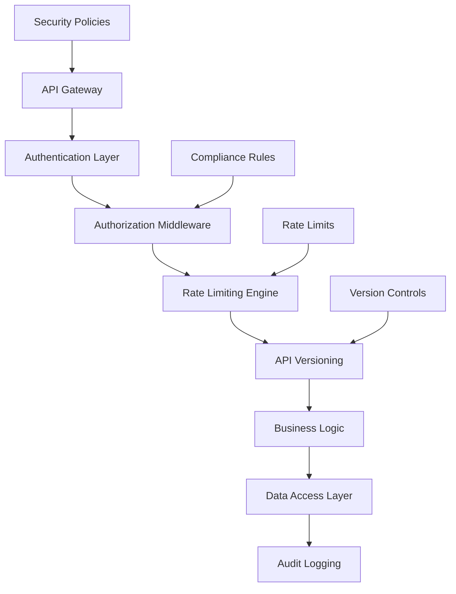

# Enterprise API Governance

## Table of Contents

1. [Executive Summary](#executive-summary)
2. [Security Architecture](#security-architecture)
3. [Rate Limiting Policies](#rate-limiting-policies)
4. [API Versioning Strategy](#api-versioning-strategy)
5. [Compliance Standards](#compliance-standards)
6. [Implementation Guidelines](#implementation-guidelines)
7. [Monitoring & Alerting](#monitoring--alerting)
8. [Audit & Logging](#audit--logging)
9. [Error Handling Standards](#error-handling-standards)
10. [Data Privacy Controls](#data-privacy-controls)
11. [Appendices](#appendices)

## Executive Summary

### Purpose
This document establishes comprehensive API governance policies for CR AudioViz AI enterprise deployments, ensuring security, scalability, compliance, and maintainability across Fortune 50 environments.

### Key Objectives
- **Security**: Implement zero-trust API security with multi-layered authentication
- **Scalability**: Enforce rate limiting and resource management policies
- **Compliance**: Maintain adherence to SOC 2, GDPR, HIPAA, and PCI DSS standards
- **Reliability**: Establish SLA targets of 99.9% uptime with <200ms response times
- **Auditability**: Comprehensive logging and monitoring for regulatory compliance

### Governance Framework


## Security Architecture

### Authentication Framework

#### OAuth 2.0 / OpenID Connect Implementation
```typescript
// enterprise/auth/oauth-config.ts
export const enterpriseOAuthConfig = {
  providers: {
    microsoft: {
      clientId: process.env.AZURE_AD_CLIENT_ID,
      clientSecret: process.env.AZURE_AD_CLIENT_SECRET,
      tenantId: process.env.AZURE_AD_TENANT_ID,
      scope: 'openid profile email User.Read',
      wellKnown: `https://login.microsoftonline.com/${process.env.AZURE_AD_TENANT_ID}/v2.0/.well-known/openid_configuration`
    },
    okta: {
      clientId: process.env.OKTA_CLIENT_ID,
      clientSecret: process.env.OKTA_CLIENT_SECRET,
      issuer: process.env.OKTA_ISSUER,
      scope: 'openid profile email groups'
    }
  },
  jwt: {
    secret: process.env.NEXTAUTH_SECRET,
    signingKey: process.env.JWT_SIGNING_KEY,
    encryptionKey: process.env.JWT_ENCRYPTION_KEY,
    maxAge: 24 * 60 * 60, // 24 hours
    updateAge: 24 * 60 * 60 // Update session every 24 hours
  }
}
```

#### API Key Management
```typescript
// enterprise/auth/api-key-manager.ts
export class EnterpriseAPIKeyManager {
  async generateAPIKey(organizationId: string, scopes: string[]): Promise<APIKey> {
    const keyData = {
      id: generateUUID(),
      organizationId,
      keyHash: await this.hashKey(this.generateSecureKey()),
      scopes,
      rateLimit: this.getRateLimitForOrganization(organizationId),
      expiresAt: new Date(Date.now() + 365 * 24 * 60 * 60 * 1000), // 1 year
      createdAt: new Date(),
      isActive: true
    }
    
    await this.storeAPIKey(keyData)
    return keyData
  }

  async validateAPIKey(key: string): Promise<ValidationResult> {
    const keyHash = await this.hashKey(key)
    const storedKey = await this.getAPIKeyByHash(keyHash)
    
    if (!storedKey || !storedKey.isActive || storedKey.expiresAt < new Date()) {
      return { valid: false, reason: 'Invalid or expired key' }
    }
    
    return {
      valid: true,
      organizationId: storedKey.organizationId,
      scopes: storedKey.scopes,
      rateLimit: storedKey.rateLimit
    }
  }
}
```

#### JWT Token Validation
```typescript
// enterprise/auth/jwt-validator.ts
export class JWTValidator {
  async validateToken(token: string): Promise<TokenValidationResult> {
    try {
      const decoded = jwt.verify(token, this.getSigningKey(), {
        algorithms: ['RS256'],
        issuer: this.getAllowedIssuers(),
        audience: process.env.JWT_AUDIENCE,
        clockTolerance: 30 // 30 seconds clock skew tolerance
      }) as JWTPayload
      
      // Additional enterprise validation
      if (!await this.isUserActive(decoded.sub)) {
        throw new Error('User account is inactive')
      }
      
      if (!await this.hasRequiredPermissions(decoded.sub, decoded.scope)) {
        throw new Error('Insufficient permissions')
      }
      
      return {
        valid: true,
        payload: decoded,
        organizationId: decoded.org_id,
        permissions: decoded.scope
      }
    } catch (error) {
      return {
        valid: false,
        error: error.message
      }
    }
  }
}
```

### Authorization Middleware

#### Role-Based Access Control (RBAC)
```typescript
// enterprise/middleware/rbac.ts
export const rbacMiddleware = (requiredRoles: string[]) => {
  return async (req: NextApiRequest, res: NextApiResponse, next: NextFunction) => {
    try {
      const token = extractBearerToken(req)
      const validation = await jwtValidator.validateToken(token)
      
      if (!validation.valid) {
        return res.status(401).json({ error: 'Unauthorized' })
      }
      
      const userRoles = validation.payload.roles || []
      const hasRequiredRole = requiredRoles.some(role => userRoles.includes(role))
      
      if (!hasRequiredRole) {
        await auditLogger.logUnauthorizedAccess(req, validation.payload.sub)
        return res.status(403).json({ error: 'Forbidden' })
      }
      
      req.user = validation.payload
      next()
    } catch (error) {
      await errorLogger.logSecurityError('RBAC_VALIDATION_FAILED', error, req)
      return res.status(500).json({ error: 'Internal server error' })
    }
  }
}
```

#### Attribute-Based Access Control (ABAC)
```typescript
// enterprise/middleware/abac.ts
export class ABACEngine {
  async evaluatePolicy(
    subject: Subject,
    resource: Resource,
    action: Action,
    environment: Environment
  ): Promise<PolicyDecision> {
    const policies = await this.getPoliciesForResource(resource.type)
    
    for (const policy of policies) {
      const decision = await this.evaluateRule(policy, {
        subject,
        resource,
        action,
        environment
      })
      
      if (decision.effect === 'DENY') {
        return decision
      }
    }
    
    return { effect: 'PERMIT', obligations: [] }
  }
  
  private async evaluateRule(policy: Policy, context: PolicyContext): Promise<PolicyDecision> {
    // Complex policy evaluation logic
    const conditions = policy.conditions
    
    for (const condition of conditions) {
      if (!await this.evaluateCondition(condition, context)) {
        return { effect: 'DENY', reason: `Condition failed: ${condition.name}` }
      }
    }
    
    return { effect: 'PERMIT', obligations: policy.obligations }
  }
}
```

## Rate Limiting Policies

### Tier-Based Rate Limiting

#### Rate Limit Configuration
```typescript
// enterprise/rate-limiting/config.ts
export const rateLimitTiers = {
  BASIC: {
    requestsPerMinute: 100,
    requestsPerHour: 1000,
    requestsPerDay: 10000,
    burstCapacity: 150,
    concurrentRequests: 10
  },
  PROFESSIONAL: {
    requestsPerMinute: 500,
    requestsPerHour: 10000,
    requestsPerDay: 100000,
    burstCapacity: 750,
    concurrentRequests: 50
  },
  ENTERPRISE: {
    requestsPerMinute: 2000,
    requestsPerHour: 50000,
    requestsPerDay: 1000000,
    burstCapacity: 3000,
    concurrentRequests: 200
  },
  UNLIMITED: {
    requestsPerMinute: -1, // Unlimited
    requestsPerHour: -1,
    requestsPerDay: -1,
    burstCapacity: 5000,
    concurrentRequests: 500
  }
}

export const endpointSpecificLimits = {
  '/api/v1/audio/process': {
    weight: 10, // Heavy operation
    maxFileSize: 100 * 1024 * 1024, // 100MB
    timeoutMs: 30000
  },
  '/api/v1/visualization/generate': {
    weight: 5,
    maxConcurrent: 5,
    timeoutMs: 15000
  },
  '/api/v1/projects': {
    weight: 1,
    cacheMaxAge: 300 // 5 minutes
  }
}
```

#### Rate Limiting Engine
```typescript
// enterprise/rate-limiting/engine.ts
export class EnterpriseRateLimiter {
  private redis: Redis
  private metrics: MetricsCollector
  
  constructor() {
    this.redis = new Redis(process.env.REDIS_URL)
    this.metrics = new MetricsCollector()
  }
  
  async checkLimit(
    identifier: string,
    tier: string,
    endpoint: string
  ): Promise<RateLimitResult> {
    const tierLimits = rateLimitTiers[tier]
    const endpointConfig = endpointSpecificLimits[endpoint]
    const weight = endpointConfig?.weight || 1
    
    const keys = [
      `rate_limit:${identifier}:minute`,
      `rate_limit:${identifier}:hour`,
      `rate_limit:${identifier}:day`,
      `concurrent:${identifier}`
    ]
    
    const pipeline = this.redis.pipeline()
    
    // Check current usage
    keys.forEach(key => pipeline.get(key))
    const results = await pipeline.exec()
    
    const [minuteCount, hourCount, dayCount, concurrentCount] = 
      results.map(([, value]) => parseInt(value as string) || 0)
    
    // Check limits
    if (minuteCount + weight > tierLimits.requestsPerMinute) {
      await this.logRateLimitExceeded(identifier, 'minute', minuteCount, tierLimits.requestsPerMinute)
      return {
        allowed: false,
        reason: 'Minute limit exceeded',
        resetTime: await this.getResetTime('minute'),
        remaining: Math.max(0, tierLimits.requestsPerMinute - minuteCount)
      }
    }
    
    // Apply rate limit
    await this.incrementCounters(identifier, weight)
    
    return {
      allowed: true,
      remaining: {
        minute: tierLimits.requestsPerMinute - minuteCount - weight,
        hour: tierLimits.requestsPerHour - hourCount - weight,
        day: tierLimits.requestsPerDay - dayCount - weight
      }
    }
  }
  
  async handleBurstTraffic(identifier: string, tier: string): Promise<BurstResult> {
    const tierLimits = rateLimitTiers[tier]
    const burstKey = `burst:${identifier}`
    
    const burstCount = await this.redis.get(burstKey) || 0
    
    if (parseInt(burstCount.toString()) >= tierLimits.burstCapacity) {
      return { allowed: false, waitTime: 1000 }
    }
    
    await this.redis.setex(burstKey, 60, parseInt(burstCount.toString()) + 1)
    return { allowed: true }
  }
}
```

#### Rate Limit Middleware
```typescript
// enterprise/middleware/rate-limit.ts
export const rateLimitMiddleware = async (
  req: NextApiRequest,
  res: NextApiResponse,
  next: NextFunction
) => {
  try {
    const identifier = getClientIdentifier(req)
    const tier = await getUserTier(req.user?.organizationId)
    const endpoint = req.url
    
    const rateLimitResult = await rateLimiter.checkLimit(identifier, tier, endpoint)
    
    // Add rate limit headers
    res.setHeader('X-RateLimit-Limit', rateLimitResult.limit)
    res.setHeader('X-RateLimit-Remaining', rateLimitResult.remaining)
    res.setHeader('X-RateLimit-Reset', rateLimitResult.resetTime)
    
    if (!rateLimitResult.allowed) {
      return res.status(429).json({
        error: 'Rate limit exceeded',
        message: rateLimitResult.reason,
        retryAfter: rateLimitResult.retryAfter
      })
    }
    
    next()
  } catch (error) {
    await errorLogger.logError('RATE_LIMIT_ERROR', error, req)
    next() // Allow request to proceed on rate limiter failure
  }
}
```

### Quota Management

#### Quota Tracking System
```typescript
// enterprise/quota/manager.ts
export class QuotaManager {
  async checkQuota(organizationId: string, resourceType: string, amount: number): Promise<QuotaResult> {
    const quota = await this.getQuota(organizationId, resourceType)
    const usage = await this.getCurrentUsage(organizationId, resourceType)
    
    if (usage + amount > quota.limit) {
      return {
        allowed: false,
        quota: quota.limit,
        used: usage,
        remaining: Math.max(0, quota.limit - usage),
        overage: (usage + amount) - quota.limit
      }
    }
    
    await this.incrementUsage(organizationId, resourceType, amount)
    
    return {
      allowed: true,
      quota: quota.limit,
      used: usage + amount,
      remaining: quota.limit - usage - amount
    }
  }
  
  async resetQuotas(): Promise<void> {
    // Daily quota reset job
    const organizations = await this.getAllOrganizations()
    
    for (const org of organizations) {
      await this.resetOrganizationQuotas(org.id)
      await this.notifyQuotaReset(org.id)
    }
  }
}
```

## API Versioning Strategy

### Semantic Versioning

#### Version Management
```typescript
// enterprise/versioning/manager.ts
export class APIVersionManager {
  private supportedVersions = ['v1', 'v2', 'v3']
  private defaultVersion = 'v3'
  private deprecatedVersions = new Map([
    ['v1', new Date('2024-12-31')], // Sunset date
    ['v2', new Date('2025-06-30')]
  ])
  
  extractVersion(req: NextApiRequest): string {
    // Priority order: URL path > Accept header > Query param > Default
    const pathVersion = this.extractFromPath(req.url)
    if (pathVersion) return pathVersion
    
    const headerVersion = this.extractFromAcceptHeader(req.headers.accept)
    if (headerVersion) return headerVersion
    
    const queryVersion = req.query.version as string
    if (queryVersion && this.isValidVersion(queryVersion)) return queryVersion
    
    return this.defaultVersion
  }
  
  async handleVersionDeprecation(version: string, req: NextApiRequest, res: NextApiResponse): Promise<void> {
    if (this.deprecatedVersions.has(version)) {
      const sunsetDate = this.deprecatedVersions.get(version)
      
      res.setHeader('Sunset', sunsetDate.toISOString())
      res.setHeader('Deprecation', 'true')
      res.setHeader('Link', `</api/${this.defaultVersion}/docs>; rel="successor-version"`)
      
      await this.logDeprecatedVersionUsage(version, req)
      
      if (new Date() > sunsetDate) {
        throw new Error(`API version ${version} has been sunset. Please upgrade to ${this.defaultVersion}`)
      }
    }
  }
}
```

#### Version Routing
```typescript
// enterprise/versioning/router.ts
export class VersionedAPIRouter {
  private versionHandlers = new Map<string, APIHandler>()
  
  constructor() {
    this.versionHandlers.set('v1', new V1Handler())
    this.versionHandlers.set('v2', new V2Handler())
    this.versionHandlers.set('v3', new V3Handler())
  }
  
  async route(req: NextApiRequest, res: NextApiResponse): Promise<void> {
    const version = this.versionManager.extractVersion(req)
    const handler = this.versionHandlers.get(version)
    
    if (!handler) {
      return res.status(400).json({
        error: 'Unsupported API version',
        supportedVersions: Array.from(this.versionHandlers.keys()),
        requestedVersion: version
      })
    }
    
    // Handle version deprecation warnings
    await this.versionManager.handleVersionDeprecation(version, req, res)
    
    // Add version information to response
    res.setHeader('API-Version', version)
    res.setHeader('Supported-Versions', Array.from(this.versionHandlers.keys()).join(', '))
    
    // Route to version-specific handler
    await handler.handle(req, res)
  }
}
```

### Backward Compatibility

#### Schema Evolution
```typescript
// enterprise/versioning/schema-transformer.ts
export class SchemaTransformer {
  async transformResponse(data: any, fromVersion: string, toVersion: string): Promise<any> {
    const transformationPipeline = this.getTransformationPipeline(fromVersion, toVersion)
    
    let transformedData = data
    for (const transformer of transformationPipeline) {
      transformedData = await transformer.transform(transformedData)
    }
    
    return transformedData
  }
  
  private getTransformationPipeline(from: string, to: string): Transformer[] {
    const transformers: Transformer[] = []
    
    if (from === 'v1' && to === 'v2') {
      transformers.push(new V1ToV2Transformer())
    }
    
    if (from === 'v2' && to === 'v3') {
      transformers.push(new V2ToV3Transformer())
    }
    
    if (from === 'v1' && to === 'v3') {
      transformers.push(new V1ToV2Transformer(), new V2ToV3Transformer())
    }
    
    return transformers
  }
}

class V1ToV2Transformer implements Transformer {
  async transform(data: any): Promise<any> {
    return {
      ...data,
      // Transform field names
      audioFileId: data.audio_file_id,
      createdAt: data.created_at,
      updatedAt: data.updated_at,
      // Add new fields with defaults
      metadata: data.metadata || {},
      tags: data.tags || []
    }
  }
}
```

## Compliance Standards

### SOC 2 Type II Compliance

#### Security Controls Implementation
```typescript
// enterprise/compliance/soc2-controls.ts
export class SOC2Controls {
  // CC6.1 - Logical and Physical Access Controls
  async enforceAccessControls(): Promise<void> {
    await this.implementMultiFactorAuthentication()
    await this.enforcePasswordPolicy()
    await this.configureSessionManagement()
    await this.setupPrivilegedAccessManagement()
  }
  
  // CC6.7 - Data Transmission and Disposal
  async enforceDataProtection(): Promise<void> {
    await this.enforceEncryptionInTransit()
    await this.enforceEncryptionAtRest()
    await this.implementSecureDataDisposal()
  }
  
  // CC7.2 - System Monitoring
  async implementSystemMonitoring(): Promise<void> {
    await this.setupSecurityEventMonitoring()
    await this.configureAnomalyDetection()
    await this.implementIncidentResponse()
  }
  
  private async enforceEncryptionInTransit(): Promise<void> {
    // Enforce TLS 1.3 minimum
    const tlsConfig = {
      minVersion: 'TLSv1.3',
      ciphers: [
        'TLS_AES_256_GCM_SHA384',
        'TLS_CHACHA20_POLY1305_SHA256',
        'TLS_AES_128_GCM_SHA256'
      ],
      honorCipherOrder: true,
      secureProtocol: 'TLSv1_3_method'
    }
    
    await this.applyTLSConfiguration(tlsConfig)
  }
}
```

### GDPR Compliance

#### Data Processing Tracking
```typescript
// enterprise/compliance/gdpr.ts
export class GDPRComplianceManager {
  async processPersonalData(
    data: PersonalData,
    processingPurpose: string,
    legalBasis: LegalBasis
  ): Promise<ProcessingResult> {
    // Record processing activity
    await this.recordProcessingActivity({
      dataType: data.type,
      purpose: processingPurpose,
      legalBasis,
      timestamp: new Date(),
      dataSubjectId: data.subjectId
    })
    
    // Check retention period
    if (await this.isRetentionPeriodExceeded(data)) {
      await this.scheduleDataDeletion(data.id)
      throw new Error('Data retention period exceeded')
    }
    
    return { processed: true, processingId: generateUUID() }
  }
  
  async handleDataSubjectRequest(request: DataSubjectRequest): Promise<void> {
    switch (request.type) {
      case 'ACCESS':
        await this.handleAccessRequest(request)
        break
      case 'RECTIFICATION':
        await this.handleRectificationRequest(request)
        break
      case 'ERASURE':
        await this.handleErasureRequest(request)
        break
      case 'PORTABILITY':
        await this.handlePortabilityRequest(request)
        break
    }
    
    await this.logDataSubjectRequest(request)
  }
  
  private async handleErasureRequest(request: DataSubjectRequest