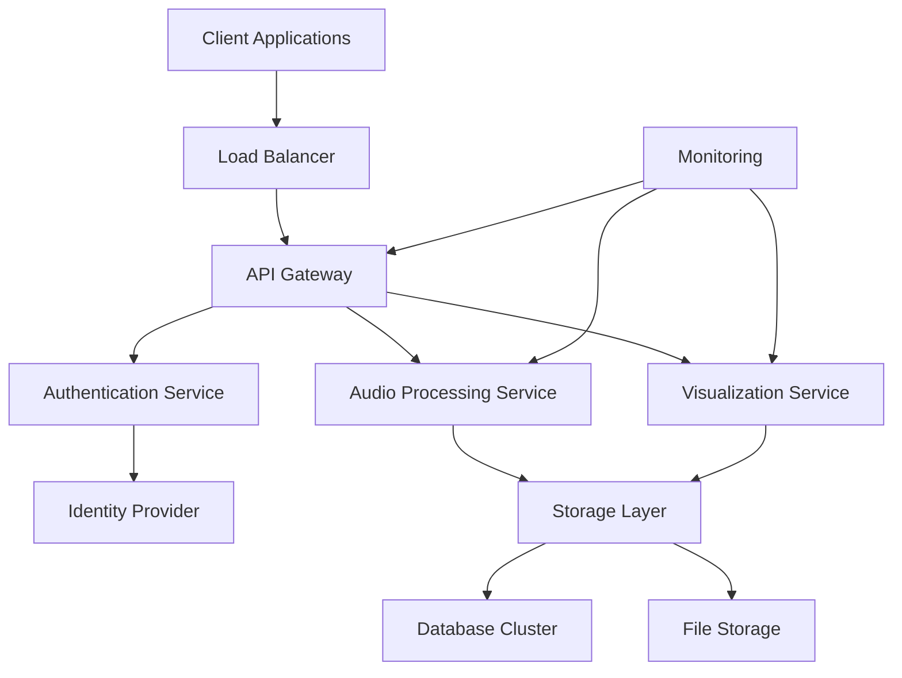

# CR AudioViz AI - Enterprise Integration Documentation

## Overview

CR AudioViz AI provides enterprise-grade audio visualization and processing capabilities with comprehensive APIs, security frameworks, and integration options designed for Fortune 500 companies and large-scale deployments.

## Table of Contents

- [Quick Start](#quick-start)
- [API Reference](#api-reference)
- [Integration Guides](#integration-guides)
- [Security & Compliance](#security--compliance)
- [SDKs & Examples](#sdks--examples)
- [Troubleshooting](#troubleshooting)
- [Support](#support)

## Quick Start

### Prerequisites

- Enterprise account with CR AudioViz AI
- API keys and authentication credentials
- Network access configuration
- SSL certificates for secure connections

### Initial Setup

```bash
# Install enterprise SDK
npm install @cr-audioviz/enterprise-sdk

# Configure authentication
export CRAV_API_KEY="your_enterprise_api_key"
export CRAV_BASE_URL="https://enterprise-api.craudioviz.com"
```

## API Reference

### [Authentication & Authorization](./api-reference/authentication.md)
- OAuth 2.0 / OpenID Connect
- JWT token management
- API key authentication
- Role-based access control (RBAC)

### [Audio Processing API](./api-reference/audio-processing.md)
- Real-time audio analysis
- Batch processing endpoints
- Format conversion utilities
- Quality optimization

### [Visualization API](./api-reference/visualization.md)
- Custom visualization generation
- Real-time data streaming
- Export capabilities
- Theme customization

### [Webhooks & Events](./api-reference/webhooks.md)
- Event subscription management
- Payload verification
- Retry mechanisms
- Error handling

## Integration Guides

### Identity Providers
- [Single Sign-On (SSO) Setup](./integration-guides/sso-setup.md)
- [LDAP Configuration](./integration-guides/ldap-configuration.md)
- [Azure Active Directory](./integration-guides/azure-ad.md)
- [Okta Integration](./integration-guides/okta-integration.md)

### Infrastructure
- [Custom Domain Configuration](./integration-guides/custom-domains.md)
- [Load Balancing Setup](./integration-guides/load-balancing.md)
- [CDN Integration](./integration-guides/cdn-setup.md)

## Security & Compliance

### [Compliance Frameworks](./security/compliance-frameworks.md)
- SOC 2 Type II compliance
- GDPR data protection
- HIPAA healthcare standards
- ISO 27001 certification

### [Data Encryption](./security/data-encryption.md)
- End-to-end encryption
- Data at rest protection
- Key management systems
- Certificate rotation

### [Audit & Monitoring](./security/audit-logging.md)
- Comprehensive audit trails
- Real-time monitoring
- Security event alerting
- Compliance reporting

### [Network Security](./security/network-security.md)
- VPC configuration
- Firewall rules
- DDoS protection
- IP whitelisting

## SDKs & Examples

### [JavaScript/TypeScript SDK](./sdk/javascript-sdk.md)

```javascript
import { CRAudioViz } from '@cr-audioviz/enterprise-sdk';

const client = new CRAudioViz({
  apiKey: process.env.CRAV_API_KEY,
  environment: 'production'
});

// Process audio file
const result = await client.audio.process({
  file: audioBuffer,
  options: {
    quality: 'enterprise',
    realtime: true
  }
});
```

### [Python SDK](./sdk/python-sdk.md)

```python
from cr_audioviz import EnterpriseClient

client = EnterpriseClient(
    api_key=os.environ['CRAV_API_KEY'],
    environment='production'
)

# Batch process multiple files
results = client.audio.batch_process(
    files=['audio1.wav', 'audio2.mp3'],
    options={'quality': 'enterprise'}
)
```

### [REST API Examples](./sdk/rest-api-examples.md)

```bash
# Upload and process audio
curl -X POST https://enterprise-api.craudioviz.com/v1/audio/process \
  -H "Authorization: Bearer ${CRAV_TOKEN}" \
  -H "Content-Type: multipart/form-data" \
  -F "file=@audio.wav" \
  -F "options={\"quality\":\"enterprise\"}"
```

## Troubleshooting

### [Common Issues](./troubleshooting/common-issues.md)
- Authentication failures
- Rate limiting issues
- File format compatibility
- Network connectivity problems

### [Performance Optimization](./troubleshooting/performance-optimization.md)
- Caching strategies
- Request optimization
- Load balancing configuration
- Resource scaling

### [Monitoring & Alerts](./troubleshooting/monitoring-alerts.md)
- Health check endpoints
- Custom metrics
- Alert configuration
- Dashboard setup

## Architecture Overview



## Enterprise Features

### High Availability
- 99.99% uptime SLA
- Multi-region deployment
- Automatic failover
- Real-time health monitoring

### Scalability
- Auto-scaling infrastructure
- Load balancing
- CDN integration
- Caching layers

### Security
- Enterprise-grade encryption
- SOC 2 Type II compliance
- Regular security audits
- Penetration testing

### Support
- 24/7 enterprise support
- Dedicated customer success manager
- Priority bug fixes
- Custom feature development

## Getting Started Checklist

- [ ] Obtain enterprise API credentials
- [ ] Configure network access and firewalls
- [ ] Set up identity provider integration
- [ ] Install and configure SDKs
- [ ] Implement authentication flow
- [ ] Test API endpoints
- [ ] Configure monitoring and alerts
- [ ] Review security settings
- [ ] Schedule user training
- [ ] Plan go-live deployment

## Rate Limits & Quotas

| Tier | Requests/minute | Concurrent Connections | Storage Limit |
|------|----------------|----------------------|---------------|
| Enterprise | 10,000 | 1,000 | 10TB |
| Enterprise+ | 50,000 | 5,000 | 50TB |
| Custom | Unlimited | Unlimited | Unlimited |

## Support Channels

### Enterprise Support
- **Email**: enterprise-support@craudioviz.com
- **Phone**: +1-800-CRAV-ENT
- **Slack**: #cr-audioviz-enterprise
- **Portal**: https://support.craudioviz.com

### Documentation Updates
- **Changelog**: [View latest changes](./changelog.md)
- **API Versioning**: [Version management](./api-versioning.md)
- **Migration Guides**: [Upgrade assistance](./migration-guides.md)

---

**Last Updated**: November 2024  
**Version**: 2.1.0  
**Support Level**: Enterprise

For technical questions or implementation assistance, contact your dedicated Customer Success Manager or reach out through our enterprise support channels.