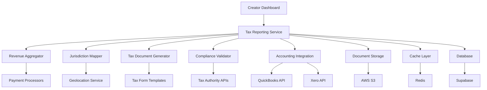

# Tax Reporting Microservice

## Overview

The Tax Reporting Microservice is a comprehensive solution for automated tax document generation and compliance management for creators across multiple jurisdictions. This service handles revenue aggregation, tax calculations, form generation, and secure delivery of tax documents while maintaining compliance with various international tax authorities.

## Architecture



## Key Features

- **Multi-Jurisdiction Support**: Handles tax compliance for US, Canada, UK, EU, and other regions
- **Automated Form Generation**: Creates 1099-NEC, T4A, P60, and other jurisdiction-specific forms
- **Real-time Tax Calculations**: Processes withholdings and estimated tax payments
- **Accounting Platform Integration**: Syncs with QuickBooks, Xero, and other platforms
- **Secure Document Delivery**: Encrypted storage and transmission of sensitive tax data
- **Audit Trail Maintenance**: Complete compliance tracking and reporting

## Core Components

### TaxReportingService

Main orchestration service that coordinates tax reporting operations.

```typescript
interface TaxReportingService {
  generateTaxDocuments(creatorId: string, taxYear: number): Promise<TaxDocumentSet>;
  calculateEstimatedTaxes(creatorId: string): Promise<EstimatedTaxCalculation>;
  submitToTaxAuthority(documentId: string, jurisdiction: string): Promise<SubmissionResult>;
  getComplianceStatus(creatorId: string): Promise<ComplianceStatus>;
}

class TaxReportingServiceImpl implements TaxReportingService {
  constructor(
    private revenueAggregator: RevenueAggregator,
    private jurisdictionMapper: JurisdictionMapper,
    private documentGenerator: TaxDocumentGenerator,
    private complianceValidator: ComplianceValidator
  ) {}

  async generateTaxDocuments(creatorId: string, taxYear: number): Promise<TaxDocumentSet> {
    const revenue = await this.revenueAggregator.aggregateRevenue(creatorId, taxYear);
    const jurisdictions = await this.jurisdictionMapper.determineJurisdictions(creatorId, revenue);
    
    const documents = await Promise.all(
      jurisdictions.map(jurisdiction => 
        this.documentGenerator.generateDocument(creatorId, revenue, jurisdiction, taxYear)
      )
    );
    
    return {
      creatorId,
      taxYear,
      documents,
      generatedAt: new Date(),
      status: 'generated'
    };
  }
}
```

### JurisdictionMapper

Determines applicable tax jurisdictions based on creator location and revenue sources.

```typescript
interface JurisdictionMapper {
  determineJurisdictions(creatorId: string, revenue: RevenueData): Promise<TaxJurisdiction[]>;
  getApplicableForms(jurisdiction: TaxJurisdiction): Promise<TaxForm[]>;
}

class JurisdictionMapperImpl implements JurisdictionMapper {
  async determineJurisdictions(creatorId: string, revenue: RevenueData): Promise<TaxJurisdiction[]> {
    const creator = await this.getCreatorProfile(creatorId);
    const jurisdictions: TaxJurisdiction[] = [];
    
    // Primary jurisdiction based on residence
    jurisdictions.push(await this.mapResidenceJurisdiction(creator.residenceCountry));
    
    // Additional jurisdictions based on revenue sources
    for (const source of revenue.sources) {
      const jurisdiction = await this.mapRevenueSourceJurisdiction(source);
      if (!jurisdictions.includes(jurisdiction)) {
        jurisdictions.push(jurisdiction);
      }
    }
    
    return jurisdictions;
  }
}
```

### TaxDocumentGenerator

Generates jurisdiction-specific tax forms and documents.

```typescript
interface TaxDocumentGenerator {
  generateDocument(
    creatorId: string, 
    revenue: RevenueData, 
    jurisdiction: TaxJurisdiction, 
    taxYear: number
  ): Promise<TaxDocument>;
}

class TaxDocumentGeneratorImpl implements TaxDocumentGenerator {
  async generateDocument(
    creatorId: string, 
    revenue: RevenueData, 
    jurisdiction: TaxJurisdiction, 
    taxYear: number
  ): Promise<TaxDocument> {
    const template = await this.getTemplate(jurisdiction);
    const taxCalculation = await this.calculateTaxes(revenue, jurisdiction);
    
    const document = await this.populateTemplate(template, {
      creatorId,
      revenue,
      taxCalculation,
      taxYear,
      jurisdiction
    });
    
    // Generate PDF and store securely
    const pdf = await this.generatePDF(document);
    const documentUrl = await this.storeDocument(pdf, creatorId, jurisdiction, taxYear);
    
    return {
      id: generateId(),
      creatorId,
      jurisdiction: jurisdiction.code,
      taxYear,
      formType: template.formType,
      documentUrl,
      generatedAt: new Date(),
      status: 'generated'
    };
  }
}
```

### AccountingIntegration

Integrates with popular accounting platforms for seamless data synchronization.

```typescript
interface AccountingIntegration {
  syncRevenueData(creatorId: string): Promise<RevenueSync>;
  exportTaxDocuments(creatorId: string, platform: AccountingPlatform): Promise<ExportResult>;
  createExpenseEntries(creatorId: string, expenses: TaxExpense[]): Promise<void>;
}

class AccountingIntegrationImpl implements AccountingIntegration {
  constructor(
    private quickBooksClient: QuickBooksClient,
    private xeroClient: XeroClient
  ) {}

  async syncRevenueData(creatorId: string): Promise<RevenueSync> {
    const creator = await this.getCreatorAccounting(creatorId);
    
    switch (creator.platform) {
      case 'quickbooks':
        return this.syncQuickBooksData(creator.credentials);
      case 'xero':
        return this.syncXeroData(creator.credentials);
      default:
        throw new Error(`Unsupported accounting platform: ${creator.platform}`);
    }
  }

  private async syncQuickBooksData(credentials: QuickBooksCredentials): Promise<RevenueSync> {
    const invoices = await this.quickBooksClient.getInvoices(credentials);
    const payments = await this.quickBooksClient.getPayments(credentials);
    
    return {
      totalRevenue: this.calculateTotalRevenue(invoices, payments),
      expenses: await this.quickBooksClient.getExpenses(credentials),
      lastSyncAt: new Date()
    };
  }
}
```

### ComplianceValidator

Validates tax documents and ensures compliance with jurisdiction requirements.

```typescript
interface ComplianceValidator {
  validateDocument(document: TaxDocument): Promise<ValidationResult>;
  checkComplianceStatus(creatorId: string): Promise<ComplianceStatus>;
  generateAuditTrail(creatorId: string): Promise<AuditTrail>;
}

class ComplianceValidatorImpl implements ComplianceValidator {
  async validateDocument(document: TaxDocument): Promise<ValidationResult> {
    const rules = await this.getComplianceRules(document.jurisdiction);
    const errors: ValidationError[] = [];
    const warnings: ValidationWarning[] = [];
    
    for (const rule of rules) {
      const result = await this.applyRule(rule, document);
      if (result.errors) errors.push(...result.errors);
      if (result.warnings) warnings.push(...result.warnings);
    }
    
    return {
      isValid: errors.length === 0,
      errors,
      warnings,
      validatedAt: new Date()
    };
  }
}
```

## API Reference

### REST Endpoints

#### Generate Tax Documents
```http
POST /api/v1/tax/generate
Content-Type: application/json
Authorization: Bearer {token}

{
  "creatorId": "creator_123",
  "taxYear": 2024,
  "jurisdictions": ["US", "CA", "UK"]
}
```

**Response:**
```json
{
  "documentSet": {
    "id": "doc_set_456",
    "creatorId": "creator_123",
    "taxYear": 2024,
    "documents": [
      {
        "id": "doc_789",
        "jurisdiction": "US",
        "formType": "1099-NEC",
        "documentUrl": "https://s3.amazonaws.com/tax-docs/...",
        "status": "generated"
      }
    ],
    "generatedAt": "2024-01-15T10:30:00Z",
    "status": "completed"
  }
}
```

#### Calculate Estimated Taxes
```http
GET /api/v1/tax/estimated/{creatorId}
Authorization: Bearer {token}
```

**Response:**
```json
{
  "calculation": {
    "creatorId": "creator_123",
    "estimatedQuarterlyTax": 2500.00,
    "annualEstimate": 10000.00,
    "jurisdictions": [
      {
        "jurisdiction": "US",
        "federalTax": 7500.00,
        "stateTax": 1500.00,
        "socialSecurity": 1000.00
      }
    ],
    "calculatedAt": "2024-01-15T10:30:00Z"
  }
}
```

#### Submit to Tax Authority
```http
POST /api/v1/tax/submit
Content-Type: application/json
Authorization: Bearer {token}

{
  "documentId": "doc_789",
  "jurisdiction": "US",
  "submissionMethod": "electronic"
}
```

### WebSocket Events

```typescript
// Real-time tax calculation updates
socket.on('tax:calculation:updated', (data: {
  creatorId: string;
  calculation: EstimatedTaxCalculation;
  timestamp: Date;
}) => {
  // Handle updated tax calculations
});

// Document generation progress
socket.on('tax:document:progress', (data: {
  documentId: string;
  progress: number;
  stage: 'calculating' | 'generating' | 'validating' | 'storing';
}) => {
  // Handle generation progress
});

// Compliance alerts
socket.on('tax:compliance:alert', (data: {
  creatorId: string;
  alertType: 'deadline' | 'validation' | 'submission';
  message: string;
  severity: 'info' | 'warning' | 'error';
}) => {
  // Handle compliance alerts
});
```

## Configuration

### Environment Variables

```bash
# Database Configuration
SUPABASE_URL=https://your-project.supabase.co
SUPABASE_ANON_KEY=your-anon-key
SUPABASE_SERVICE_KEY=your-service-key

# Redis Configuration
REDIS_URL=redis://localhost:6379
REDIS_TAX_CACHE_TTL=3600

# AWS S3 Configuration
AWS_ACCESS_KEY_ID=your-access-key
AWS_SECRET_ACCESS_KEY=your-secret-key
AWS_REGION=us-west-2
S3_TAX_DOCUMENTS_BUCKET=cr-audioviz-tax-docs

# Tax Authority APIs
IRS_API_KEY=your-irs-api-key
IRS_API_ENDPOINT=https://api.irs.gov/e-file
CRA_API_KEY=your-cra-api-key
CRA_API_ENDPOINT=https://api.cra-arc.gc.ca/netfile
HMRC_API_KEY=your-hmrc-api-key
HMRC_API_ENDPOINT=https://api.service.hmrc.gov.uk/mtd

# Accounting Platform APIs
QUICKBOOKS_CLIENT_ID=your-quickbooks-client-id
QUICKBOOKS_CLIENT_SECRET=your-quickbooks-client-secret
XERO_CLIENT_ID=your-xero-client-id
XERO_CLIENT_SECRET=your-xero-client-secret

# Encryption
TAX_DATA_ENCRYPTION_KEY=your-encryption-key-32-chars
DOCUMENT_SIGNING_KEY=your-signing-key

# Rate Limiting
TAX_API_RATE_LIMIT=100
TAX_API_RATE_WINDOW=3600
```

### Docker Configuration

```yaml
# docker-compose.yml
version: '3.8'
services:
  tax-reporting-service:
    build: 
      context: .
      dockerfile: Dockerfile.tax-service
    environment:
      - NODE_ENV=production
      - PORT=3000
    ports:
      - "3000:3000"
    depends_on:
      - redis
      - postgres
    volumes:
      - tax_temp:/tmp/tax-processing
    networks:
      - cr-audioviz-network

  redis:
    image: redis:7-alpine
    ports:
      - "6379:6379"
    volumes:
      - redis_data:/data

volumes:
  tax_temp:
  redis_data:

networks:
  cr-audioviz-network:
    external: true
```

## Deployment

### Kubernetes Deployment

```yaml
apiVersion: apps/v1
kind: Deployment
metadata:
  name: tax-reporting-service
  labels:
    app: tax-reporting-service
spec:
  replicas: 3
  selector:
    matchLabels:
      app: tax-reporting-service
  template:
    metadata:
      labels:
        app: tax-reporting-service
    spec:
      containers:
      - name: tax-reporting-service
        image: cr-audioviz/tax-reporting-service:latest
        ports:
        - containerPort: 3000
        env:
        - name: NODE_ENV
          value: "production"
        - name: SUPABASE_URL
          valueFrom:
            secretKeyRef:
              name: tax-service-secrets
              key: supabase-url
        - name: TAX_DATA_ENCRYPTION_KEY
          valueFrom:
            secretKeyRef:
              name: tax-service-secrets
              key: encryption-key
        resources:
          requests:
            memory: "512Mi"
            cpu: "250m"
          limits:
            memory: "1Gi"
            cpu: "500m"
        livenessProbe:
          httpGet:
            path: /health
            port: 3000
          initialDelaySeconds: 30
          periodSeconds: 10
        readinessProbe:
          httpGet:
            path: /ready
            port: 3000
          initialDelaySeconds: 5
          periodSeconds: 5
---
apiVersion: v1
kind: Service
metadata:
  name: tax-reporting-service
spec:
  selector:
    app: tax-reporting-service
  ports:
  - protocol: TCP
    port: 80
    targetPort: 3000
  type: ClusterIP
```

## Security Implementation

### Data Encryption

```typescript
class TaxDataEncryption {
  private encryptionKey: Buffer;

  constructor(key: string) {
    this.encryptionKey = Buffer.from(key, 'hex');
  }

  encryptSensitiveData(data: any): string {
    const algorithm = 'aes-256-gcm';
    const iv = crypto.randomBytes(16);
    const cipher = crypto.createCipher(algorithm, this.encryptionKey);
    
    let encrypted = cipher.update(JSON.stringify(data), 'utf8', 'hex');
    encrypted += cipher.final('hex');
    
    const authTag = cipher.getAuthTag();
    
    return `${iv.toString('hex')}:${authTag.toString('hex')}:${encrypted}`;
  }

  decryptSensitiveData(encryptedData: string): any {
    const [ivHex, authTagHex, encrypted] = encryptedData.split(':');
    const algorithm = 'aes-256-gcm';
    const iv = Buffer.from(ivHex, 'hex');
    const authTag = Buffer.from(authTagHex, 'hex');
    
    const decipher = crypto.createDecipher(algorithm, this.encryptionKey);
    decipher.setAuthTag(authTag);
    
    let decrypted = decipher.update(encrypted, 'hex', 'utf8');
    decrypted += decipher.final('utf8');
    
    return JSON.parse(decrypted);
  }
}
```

### Access Control

```typescript
class TaxServiceAuthMiddleware {
  static validateTaxAccess(req: Request, res: Response, next: NextFunction) {
    const { creatorId } = req.params;
    const userToken = req.headers.authorization?.replace('Bearer ', '');
    
    if (!userToken) {
      return res.status(401).json({ error: 'Authentication required' });
    }
    
    const decodedToken = jwt.verify(userToken, process.env.JWT_SECRET!);
    
    // Verify user has access to creator's tax data
    if (decodedToken.sub !== creatorId && !decodedToken.roles?.includes('tax_admin')) {
      return res.status(403).json({ error: 'Insufficient permissions' });
    }
    
    req.user = decodedToken;
    next();
  }
}
```

## Monitoring and Logging

### Health Checks

```typescript
class TaxServiceHealthCheck {
  async checkHealth(): Promise<HealthStatus> {
    const checks = await Promise.allSettled([
      this.checkDatabase(),
      this.checkRedis(),
      this.checkS3(),
      this.checkTaxAuthorities(),
      this.checkAccountingPlatforms()
    ]);
    
    const healthStatus: HealthStatus = {
      status: 'healthy',
      timestamp: new Date(),
      checks: {}
    };
    
    checks.forEach((check, index) => {
      const service = ['database', 'redis', 's3', 'tax_authorities', 'accounting'][index];
      healthStatus.checks[service] = {
        status: check.status === 'fulfilled' ? 'healthy' : 'unhealthy',
        details: check.status === 'rejected' ? check.reason : 'OK'
      };
    });
    
    const hasUnhealthy = Object.values(healthStatus.checks).some(c => c.status === 'unhealthy');
    if (hasUnhealthy) {
      healthStatus.status = 'degraded';
    }
    
    return healthStatus;
  }
}
```

### Metrics Collection

```typescript
class TaxServiceMetrics {
  private static readonly metrics = {
    documentsGenerated: new Counter({
      name: 'tax_documents_generated_total',
      help: 'Total number of tax documents generated',
      labelNames: ['jurisdiction', 'form_type']
    }),
    
    calculationTime: new Histogram({
      name: 'tax_calculation_duration_seconds',
      help: 'Time spent calculating taxes',
      buckets: [0.1, 0.5, 1, 2, 5, 10]
    }),
    
    submissionSuccess: new Counter({
      name: 'tax_submissions_total',
      help: 'Total tax authority submissions',
      labelNames: ['jurisdiction', 'status']
    }),
    
    complianceIssues: new Counter({
      name: 'tax_compliance_issues_total',
      help: 'Total compliance validation issues',
      labelNames: ['issue_type', 'severity']
    })
  };

  static recordDocumentGeneration(jurisdiction: string, formType: string) {
    this.metrics.documentsGenerated.inc({ jurisdiction, form_type: formType });
  }

  static recordCalculationTime(duration: number) {
    this.metrics.calculationTime.observe(duration);
  }
}
```

## Testing

### Unit Tests

```typescript
describe('TaxReportingService', () => {
  let service: TaxReportingService;
  let mockRevenueAggregator: jest.Mocked<RevenueAggregator>;
  let mockDocumentGenerator: jest.Mocked<TaxDocumentGenerator>;

  beforeEach(() => {
    mockRevenueAggregator = {
      aggregateRevenue: jest.fn()
    };
    
    mockDocumentGenerator = {
      generateDocument: jest.fn()
    };

    service = new TaxReportingServiceImpl(
      mockRevenueAggregator,
      {} as JurisdictionMapper,
      mockDocumentGenerator,
      {} as ComplianceValidator
    );
  });

  describe('generateTaxDocuments', () => {
    it('should generate documents for all applicable jurisdictions', async () => {
      const mockRevenue = {
        totalAmount: 50000,
        sources: [{ country: 'US', amount: 50000 }]
      };

      mockRevenueAggregator.aggregateRevenue.mockResolvedValue(mockRevenue);
      mockDocumentGenerator.generateDocument.mockResolvedValue({
        id: 'doc_123',
        creatorId: 'creator_123',
        jurisdiction: 'US',
        formType: '1099-NEC'
      } as TaxDocument);

      const result = await service.generateTaxDocuments('creator_123', 2024);

      expect(result.documents).toHaveLength(1);
      expect(result.documents[0].formType).toBe('1099-NEC');
    });
  });
});
```

### Integration Tests

```typescript
describe('Tax Authority Integration', () => {
  it('should successfully submit to IRS e-file system', async () => {
    const testDocument = await generateTestTaxDocument();
    const submissionResult = await taxService.submitToTaxAuthority(
      testDocument.id,
      'US'
    );

    expect(submissionResult.status).toBe('submitted');
    expect(submissionResult.confirmationNumber).toBeDefined();
  });
});
```

## Troubleshooting

### Common Issues

1. **Document Generation Failures**
   ```typescript
   // Check template availability
   const template = await templateService.getTemplate(jurisdiction);
   if (!template) {
     throw new Error(`No template available for jurisdiction: ${jurisdiction}`);
   }
   ```

2. **Tax Authority API Errors**
   ```typescript
   // Implement retry logic with exponential backoff
   const submitWithRetry = async (document: TaxDocument, maxRetries = 3) => {
     for (let i = 0; i < maxRetries; i++) {
       try {
         return await taxAuthorityClient.submit(document);
       } catch (error) {
         if (i === maxRetries - 1) throw error;
         await new Promise(resolve => setTimeout(resolve, 1000 * Math.pow(2, i)));
       }
     }
   };
   ```

3. **Compliance Validation Errors**
   ```typescript