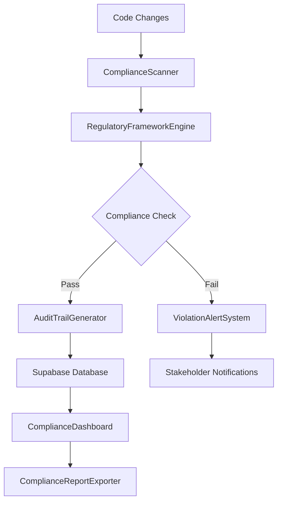

# Security Compliance Automation Guide

## Overview

The CR AudioViz AI Security Compliance Automation System provides comprehensive automated compliance checking against major regulatory frameworks including SOC 2, GDPR, HIPAA, and custom security policies. This system ensures continuous compliance monitoring with automated audit trail generation and real-time violation detection.

## Table of Contents

- [System Architecture](#system-architecture)
- [Supported Regulatory Frameworks](#supported-regulatory-frameworks)
- [Installation and Setup](#installation-and-setup)
- [Framework Configuration](#framework-configuration)
- [Automated Scanning Workflows](#automated-scanning-workflows)
- [Custom Rule Development](#custom-rule-development)
- [Audit Trail Management](#audit-trail-management)
- [Dashboard and Reporting](#dashboard-and-reporting)
- [API Reference](#api-reference)
- [Integration Examples](#integration-examples)
- [Troubleshooting](#troubleshooting)

## System Architecture

### Core Components

```typescript
// Core compliance system architecture
interface ComplianceSystemArchitecture {
  scanner: ComplianceScanner;
  auditTrail: AuditTrailGenerator;
  dashboard: ComplianceDashboard;
  frameworkEngine: RegulatoryFrameworkEngine;
  alertSystem: ViolationAlertSystem;
  reportExporter: ComplianceReportExporter;
}

// Component relationships
const complianceFlow = {
  input: ['code_changes', 'configuration_updates', 'manual_reviews'],
  processing: ['framework_validation', 'rule_evaluation', 'violation_detection'],
  output: ['audit_logs', 'compliance_reports', 'alert_notifications'],
  storage: ['supabase_compliance_checks', 'supabase_audit_logs', 'supabase_policy_violations']
};
```

### Data Flow Architecture



## Supported Regulatory Frameworks

### SOC 2 Type II
- **CC6.1**: Logical access security
- **CC6.2**: Authentication protocols
- **CC6.3**: Network security controls
- **CC7.1**: System boundaries and data classification
- **CC8.1**: Change management procedures

### GDPR (General Data Protection Regulation)
- **Article 25**: Data protection by design and by default
- **Article 32**: Security of processing
- **Article 33**: Notification of data breaches
- **Article 35**: Data protection impact assessment

### HIPAA Security Rule
- **Administrative Safeguards**: Access management and workforce training
- **Physical Safeguards**: Facility access and workstation controls
- **Technical Safeguards**: Access control and audit controls

## Installation and Setup

### Prerequisites

```bash
# Required dependencies
npm install @craviz/compliance-automation
npm install @supabase/supabase-js
npm install @types/node
npm install typescript
```

### Environment Configuration

```env
# .env.compliance
SUPABASE_URL=your_supabase_project_url
SUPABASE_ANON_KEY=your_supabase_anon_key
COMPLIANCE_DB_PASSWORD=your_compliance_db_password

# Notification services
SLACK_WEBHOOK_URL=your_slack_webhook_url
EMAIL_SERVICE_API_KEY=your_email_service_key

# Regulatory framework API keys
SOC2_SCANNER_API_KEY=your_soc2_scanner_key
GDPR_VALIDATOR_API_KEY=your_gdpr_validator_key
HIPAA_CHECKER_API_KEY=your_hipaa_checker_key

# Report generation
PDF_GENERATOR_SERVICE_URL=your_pdf_generator_url
REPORT_STORAGE_BUCKET=compliance-reports-bucket
```

### Database Schema Setup

```sql
-- Compliance checks table
CREATE TABLE compliance_checks (
  id UUID PRIMARY KEY DEFAULT gen_random_uuid(),
  framework_type VARCHAR(50) NOT NULL,
  check_name VARCHAR(255) NOT NULL,
  status VARCHAR(20) NOT NULL CHECK (status IN ('passed', 'failed', 'warning', 'skipped')),
  details JSONB,
  severity VARCHAR(20) NOT NULL CHECK (severity IN ('critical', 'high', 'medium', 'low', 'info')),
  remediation_steps TEXT[],
  created_at TIMESTAMP WITH TIME ZONE DEFAULT NOW(),
  updated_at TIMESTAMP WITH TIME ZONE DEFAULT NOW(),
  scan_id UUID NOT NULL,
  resource_type VARCHAR(100),
  resource_identifier VARCHAR(500)
);

-- Audit logs table
CREATE TABLE audit_logs (
  id UUID PRIMARY KEY DEFAULT gen_random_uuid(),
  event_type VARCHAR(100) NOT NULL,
  event_category VARCHAR(50) NOT NULL,
  user_id UUID,
  user_email VARCHAR(255),
  resource_type VARCHAR(100),
  resource_id VARCHAR(500),
  action VARCHAR(100) NOT NULL,
  event_data JSONB,
  ip_address INET,
  user_agent TEXT,
  compliance_frameworks TEXT[],
  retention_category VARCHAR(50) NOT NULL,
  retention_expires_at TIMESTAMP WITH TIME ZONE,
  created_at TIMESTAMP WITH TIME ZONE DEFAULT NOW()
);

-- Policy violations table
CREATE TABLE policy_violations (
  id UUID PRIMARY KEY DEFAULT gen_random_uuid(),
  violation_type VARCHAR(100) NOT NULL,
  severity VARCHAR(20) NOT NULL,
  framework VARCHAR(50) NOT NULL,
  policy_reference VARCHAR(200),
  description TEXT NOT NULL,
  resource_affected VARCHAR(500),
  detection_method VARCHAR(100),
  status VARCHAR(20) DEFAULT 'open' CHECK (status IN ('open', 'acknowledged', 'resolved', 'false_positive')),
  assigned_to UUID,
  remediation_deadline TIMESTAMP WITH TIME ZONE,
  remediation_notes TEXT,
  detected_at TIMESTAMP WITH TIME ZONE DEFAULT NOW(),
  resolved_at TIMESTAMP WITH TIME ZONE
);

-- Compliance scan results
CREATE TABLE compliance_scans (
  id UUID PRIMARY KEY DEFAULT gen_random_uuid(),
  scan_type VARCHAR(50) NOT NULL,
  frameworks TEXT[] NOT NULL,
  trigger_type VARCHAR(50) NOT NULL,
  triggered_by VARCHAR(255),
  scan_scope JSONB,
  total_checks INTEGER NOT NULL DEFAULT 0,
  passed_checks INTEGER NOT NULL DEFAULT 0,
  failed_checks INTEGER NOT NULL DEFAULT 0,
  warning_checks INTEGER NOT NULL DEFAULT 0,
  overall_score DECIMAL(5,2),
  started_at TIMESTAMP WITH TIME ZONE DEFAULT NOW(),
  completed_at TIMESTAMP WITH TIME ZONE,
  scan_duration_seconds INTEGER,
  status VARCHAR(20) DEFAULT 'running' CHECK (status IN ('running', 'completed', 'failed', 'cancelled'))
);

-- Indexes for performance
CREATE INDEX idx_compliance_checks_framework ON compliance_checks(framework_type);
CREATE INDEX idx_compliance_checks_status ON compliance_checks(status);
CREATE INDEX idx_compliance_checks_scan_id ON compliance_checks(scan_id);
CREATE INDEX idx_audit_logs_event_type ON audit_logs(event_type);
CREATE INDEX idx_audit_logs_user_id ON audit_logs(user_id);
CREATE INDEX idx_audit_logs_created_at ON audit_logs(created_at);
CREATE INDEX idx_policy_violations_framework ON policy_violations(framework);
CREATE INDEX idx_policy_violations_severity ON policy_violations(severity);
CREATE INDEX idx_policy_violations_status ON policy_violations(status);
```

## Framework Configuration

### SOC 2 Type II Configuration

```typescript
// src/compliance/frameworks/soc2-config.ts
export const soc2TypeIIConfig: ComplianceFrameworkConfig = {
  framework: 'SOC2_TYPE_II',
  version: '2017',
  controls: {
    CC6_1: {
      name: 'Logical Access Security',
      description: 'Logical access security measures to protect against threats',
      checks: [
        {
          id: 'CC6.1.001',
          name: 'Multi-factor authentication enforcement',
          severity: 'critical',
          automatedCheck: true,
          checkFunction: 'validateMFAEnforcement',
          schedule: '0 */6 * * *', // Every 6 hours
          scope: ['authentication', 'user_management'],
          remediation: [
            'Enable MFA for all user accounts',
            'Configure MFA bypass policies',
            'Implement MFA recovery procedures'
          ]
        },
        {
          id: 'CC6.1.002',
          name: 'Access review procedures',
          severity: 'high',
          automatedCheck: true,
          checkFunction: 'validateAccessReviews',
          schedule: '0 0 1 * *', // Monthly
          scope: ['access_control', 'user_permissions']
        }
      ]
    },
    CC6_2: {
      name: 'Authentication Protocols',
      checks: [
        {
          id: 'CC6.2.001',
          name: 'Strong password policies',
          severity: 'high',
          automatedCheck: true,
          checkFunction: 'validatePasswordPolicies'
        }
      ]
    }
  },
  evidenceRequirements: {
    CC6_1: ['mfa_configuration_screenshots', 'access_review_reports'],
    CC6_2: ['password_policy_documentation', 'authentication_logs']
  },
  reportingRequirements: {
    frequency: 'annual',
    auditorAccess: true,
    retentionPeriod: '7_years'
  }
};
```

### GDPR Configuration

```typescript
// src/compliance/frameworks/gdpr-config.ts
export const gdprConfig: ComplianceFrameworkConfig = {
  framework: 'GDPR',
  version: '2018',
  articles: {
    ARTICLE_25: {
      name: 'Data Protection by Design and Default',
      requirements: [
        {
          id: 'GDPR.25.001',
          name: 'Privacy by design implementation',
          severity: 'critical',
          checkFunction: 'validatePrivacyByDesign',
          scope: ['data_processing', 'system_design'],
          legalBasis: 'Article 25(1)',
          remediation: [
            'Implement privacy impact assessments',
            'Configure default privacy settings',
            'Document privacy design decisions'
          ]
        }
      ]
    },
    ARTICLE_32: {
      name: 'Security of Processing',
      requirements: [
        {
          id: 'GDPR.32.001',
          name: 'Encryption of personal data',
          severity: 'critical',
          checkFunction: 'validateEncryption',
          scope: ['data_storage', 'data_transmission']
        },
        {
          id: 'GDPR.32.002',
          name: 'Data breach detection capability',
          severity: 'high',
          checkFunction: 'validateBreachDetection'
        }
      ]
    }
  },
  dataSubjectRights: {
    portability: 'validateDataPortability',
    erasure: 'validateRightToErasure',
    rectification: 'validateDataRectification',
    access: 'validateDataAccess'
  },
  breachNotification: {
    supervisoryAuthority: '72_hours',
    dataSubject: 'without_undue_delay',
    documentation: 'mandatory'
  }
};
```

### HIPAA Configuration

```typescript
// src/compliance/frameworks/hipaa-config.ts
export const hipaaConfig: ComplianceFrameworkConfig = {
  framework: 'HIPAA',
  version: 'Security_Rule_2013',
  safeguards: {
    ADMINISTRATIVE: {
      name: 'Administrative Safeguards',
      requirements: [
        {
          id: 'HIPAA.ADMIN.001',
          name: 'Security Officer Assignment',
          standard: '164.308(a)(2)',
          implementation: 'required',
          checkFunction: 'validateSecurityOfficer'
        },
        {
          id: 'HIPAA.ADMIN.002',
          name: 'Workforce Training',
          standard: '164.308(a)(5)',
          implementation: 'required',
          checkFunction: 'validateWorkforceTraining'
        }
      ]
    },
    PHYSICAL: {
      name: 'Physical Safeguards',
      requirements: [
        {
          id: 'HIPAA.PHYS.001',
          name: 'Facility Access Controls',
          standard: '164.310(a)(1)',
          implementation: 'required',
          checkFunction: 'validateFacilityAccess'
        }
      ]
    },
    TECHNICAL: {
      name: 'Technical Safeguards',
      requirements: [
        {
          id: 'HIPAA.TECH.001',
          name: 'Access Control',
          standard: '164.312(a)(1)',
          implementation: 'required',
          checkFunction: 'validateTechnicalAccessControl'
        },
        {
          id: 'HIPAA.TECH.002',
          name: 'Audit Controls',
          standard: '164.312(b)',
          implementation: 'required',
          checkFunction: 'validateAuditControls'
        }
      ]
    }
  }
};
```

## Automated Scanning Workflows

### ComplianceScanner Implementation

```typescript
// src/compliance/scanner/compliance-scanner.ts
import { createClient } from '@supabase/supabase-js';
import { ComplianceFrameworkConfig, ScanResult } from './types';

export class ComplianceScanner {
  private supabase = createClient(
    process.env.SUPABASE_URL!,
    process.env.SUPABASE_ANON_KEY!
  );

  constructor(
    private frameworks: ComplianceFrameworkConfig[],
    private auditTrail: AuditTrailGenerator
  ) {}

  /**
   * Execute comprehensive compliance scan
   */
  async executeScan(options: ScanOptions): Promise<ScanResult> {
    const scanId = crypto.randomUUID();
    const startTime = new Date();

    // Create scan record
    await this.createScanRecord(scanId, options);

    try {
      const results: ComplianceCheckResult[] = [];

      for (const framework of this.frameworks) {
        if (options.frameworks?.includes(framework.framework)) {
          const frameworkResults = await this.scanFramework(
            framework,
            options.scope,
            scanId
          );
          results.push(...frameworkResults);
        }
      }

      // Calculate overall compliance score
      const overallScore = this.calculateComplianceScore(results);

      // Update scan completion
      await this.completeScan(scanId, results, overallScore, startTime);

      // Generate audit trail
      await this.auditTrail.logComplianceScan(scanId, results);

      // Check for critical violations
      await this.handleCriticalViolations(results);

      return {
        scanId,
        overallScore,
        results,
        summary: this.generateSummary(results),
        completedAt: new Date()
      };

    } catch (error) {
      await this.handleScanError(scanId, error as Error);
      throw error;
    }
  }

  /**
   * Scan specific compliance framework
   */
  private async scanFramework(
    framework: ComplianceFrameworkConfig,
    scope: string[],
    scanId: string
  ): Promise<ComplianceCheckResult[]> {
    const results: ComplianceCheckResult[] = [];

    // Iterate through all controls/requirements
    const checks = this.extractChecksFromFramework(framework);

    for (const check of checks) {
      if (this.shouldRunCheck(check, scope)) {
        const result = await this.executeCheck(check, scanId);
        results.push(result);

        // Store individual check result
        await this.storeCheckResult(result);
      }
    }

    return results;
  }

  /**
   * Execute individual compliance check
   */
  private async executeCheck(
    check: ComplianceCheck,
    scanId: string
  ): Promise<ComplianceCheckResult> {
    const startTime = performance.now();

    try {
      // Dynamic check execution based on check function
      const checkFunction = this.getCheckFunction(check.checkFunction);
      const checkResult = await checkFunction(check);

      const endTime = performance.now();

      return {
        id: crypto.randomUUID(),
        checkId: check.id,
        name: check.name,
        framework: check.framework,
        severity: check.severity,
        status: checkResult.passed ? 'passed' : 'failed',
        details: checkResult.details,
        evidence: checkResult.evidence,
        remediation: checkResult.failed ? check.remediation : [],
        executionTime: endTime - startTime,
        scanId,
        timestamp: new Date()
      };

    } catch (error) {
      return {
        id: crypto.randomUUID(),
        checkId: check.id,
        name: check.name,
        framework: check.framework,
        severity: check.severity,
        status: 'failed',
        details: { error: (error as Error).message },
        evidence: [],
        remediation: check.remediation,
        executionTime: 0,
        scanId,
        timestamp: new Date()
      };
    }
  }

  /**
   * Get check function implementation
   */
  private getCheckFunction(functionName: string): ComplianceCheckFunction {
    const checkFunctions = new Map<string, ComplianceCheckFunction>([
      ['validateMFAEnforcement', this.validateMFAEnforcement.bind(this)],
      ['validateAccessReviews', this.validateAccessReviews.bind(this)],
      ['validatePasswordPolicies', this.validatePasswordPolicies.bind(this)],
      ['validatePrivacyByDesign', this.validatePrivacyByDesign.bind(this)],
      ['validateEncryption', this.validateEncryption.bind(this)],
      ['validateBreachDetection', this.validateBreachDetection.bind(this)],
      ['validateSecurityOfficer', this.validateSecurityOfficer.bind(this)],
      ['validateWorkforceTraining', this.validateWorkforceTraining.bind(this)],
      ['validateAuditControls', this.validateAuditControls.bind(this)]
    ]);

    const checkFunction = checkFunctions.get(functionName);
    if (!checkFunction) {
      throw new Error(`Unknown check function: ${functionName}`);
    }

    return checkFunction;
  }

  /**
   * SOC 2 - Multi-factor authentication validation
   */
  private async validateMFAEnforcement(check: ComplianceCheck): Promise<CheckExecutionResult> {
    const { data: authConfig } = await this.supabase
      .from('auth_configurations')
      .select('*')
      .eq('mfa_enabled', true);

    const { data: users } = await this.supabase
      .from('users')
      .select('id, mfa_enabled')
      .eq('active', true);

    const usersWithoutMFA = users?.filter(user => !user.mfa_enabled) || [];
    const mfaComplianceRate = users ? 
      ((users.length - usersWithoutMFA.length) / users.length) * 100 : 0;

    const passed = mfaComplianceRate >= 95; // 95% compliance threshold

    return {
      passed,
      details: {
        mfaComplianceRate,
        totalUsers: users?.length || 0,
        usersWithoutMFA: usersWithoutMFA.length,
        configurationEnabled: !!authConfig?.length
      },
      evidence: [
        {
          type: 'configuration',
          description: 'MFA configuration status',
          data: authConfig
        },
        {
          type: 'user_analysis',
          description: 'User MFA adoption rates',
          data: { mfaComplianceRate, usersWithoutMFA: usersWithoutMFA.length }
        }
      ],
      failed: !passed
    };
  }

  /**
   * GDPR - Encryption validation
   */
  private async validateEncryption(check: ComplianceCheck): Promise<CheckExecutionResult> {
    // Check database encryption
    const { data: encryptionStatus } = await this.supabase
      .rpc('check_database_encryption');

    // Check data transmission encryption
    const tlsConfig = await this.checkTLSConfiguration();
    
    // Check at-rest encryption for file storage
    const storageEncryption = await this.checkStorageEncryption();

    const allEncrypted = encryptionStatus?.encrypted && 
                        tlsConfig.enabled && 
                        storageEncryption.enabled;

    return {
      passed: allEncrypted,
      details: {
        databaseEncryption: encryptionStatus?.encrypted || false,
        tlsEnabled: tlsConfig.enabled,
        tlsVersion: tlsConfig.version,
        storageEncryption: storageEncryption.enabled,
        encryptionAlgorithms: storageEncryption.algorithms
      },
      evidence: [
        {
          type: 'database_config',
          description: 'Database encryption configuration',
          data: encryptionStatus
        },
        {
          type: 'tls_config',
          description: 'TLS configuration for data transmission',
          data: tlsConfig
        }
      ],
      failed: !allEncrypted
    };
  }

  /**
   * HIPAA - Audit controls validation
   */
  private async validateAuditControls(check: ComplianceCheck): Promise<CheckExecutionResult> {
    // Check if audit logging is enabled
    const auditConfig = await this.checkAuditConfiguration();
    
    // Verify audit log retention
    const retentionPolicy = await this.checkAuditRetention();
    
    // Check access to audit logs
    const accessControls = await this.checkAuditAccessControls();

    const compliant = auditConfig.enabled && 
                     retentionPolicy.compliant && 
                     accessControls.restricted;

    return {
      passed: compliant,
      details: {
        auditingEnabled: auditConfig.enabled,
        logRetentionDays: retentionPolicy.days,
        retentionCompliant: retentionPolicy.compliant,
        accessControlsRestricted: accessControls.restricted,
        authorizedPersonnel: accessControls.authorizedCount
      },
      evidence: [
        {
          type: 'audit_configuration',
          description: 'Audit logging configuration',
          data: auditConfig
        },
        {
          type: 'retention_policy',
          description: 'Audit log retention policy',
          data: retentionPolicy
        }
      ],
      failed: !compliant
    };
  }

  /**
   * Store compliance check result
   */
  private async storeCheckResult(result: ComplianceCheckResult): Promise<void> {
    await this.supabase
      .from('compliance_checks')
      .insert({
        framework_type: result.framework,
        check_name: result.name,
        status: result.status,
        details: result.details,