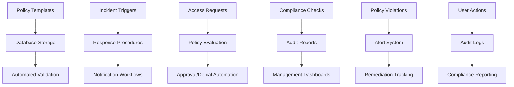

# Security Policy Documentation Framework

## Overview

The Security Policy Documentation Framework provides a comprehensive, enterprise-grade security governance system for CR AudioViz AI. This framework includes automated policy compliance checking, incident response procedures, access control policies, and multi-framework compliance support.

## Features

- **Comprehensive Policy Templates**: Pre-built templates for various security domains
- **Automated Compliance Checking**: Real-time policy validation and enforcement
- **Incident Response Automation**: Structured playbooks with automated workflows
- **Access Control Matrix**: Role-based permissions with fine-grained control
- **Multi-Framework Support**: SOC2, ISO27001, GDPR, and custom frameworks
- **Audit Trail Generation**: Comprehensive logging and reporting
- **Policy Version Control**: Change tracking and approval workflows

## Architecture

### Core Components

```typescript
interface SecurityPolicyFramework {
  policyTemplate: SecurityPolicyTemplate;
  incidentResponse: IncidentResponsePlaybook;
  accessControl: AccessControlMatrix;
  compliance: ComplianceFrameworkMapper;
  checker: PolicyComplianceChecker;
  metrics: SecurityMetricsDashboard;
  audit: AuditTrailGenerator;
  versionControl: PolicyVersionControl;
}
```

### Data Flow Architecture



## Security Policy Template System

### Policy Definition Structure

```typescript
interface SecurityPolicy {
  id: string;
  title: string;
  category: PolicyCategory;
  version: string;
  status: PolicyStatus;
  effectiveDate: Date;
  reviewDate: Date;
  owner: string;
  approvers: string[];
  description: string;
  requirements: PolicyRequirement[];
  controls: SecurityControl[];
  exceptions: PolicyException[];
  compliance: ComplianceMapping[];
  metrics: PolicyMetric[];
  created_at: Date;
  updated_at: Date;
}

enum PolicyCategory {
  ACCESS_CONTROL = 'access_control',
  DATA_PROTECTION = 'data_protection',
  INCIDENT_RESPONSE = 'incident_response',
  NETWORK_SECURITY = 'network_security',
  PHYSICAL_SECURITY = 'physical_security',
  BUSINESS_CONTINUITY = 'business_continuity',
  VENDOR_MANAGEMENT = 'vendor_management',
  ASSET_MANAGEMENT = 'asset_management'
}

enum PolicyStatus {
  DRAFT = 'draft',
  REVIEW = 'review',
  APPROVED = 'approved',
  ACTIVE = 'active',
  DEPRECATED = 'deprecated',
  ARCHIVED = 'archived'
}
```

### Database Schema

```sql
-- Security Policies Table
CREATE TABLE security_policies (
  id UUID PRIMARY KEY DEFAULT gen_random_uuid(),
  title TEXT NOT NULL,
  category policy_category NOT NULL,
  version TEXT NOT NULL,
  status policy_status NOT NULL DEFAULT 'draft',
  effective_date TIMESTAMPTZ NOT NULL,
  review_date TIMESTAMPTZ NOT NULL,
  owner_id UUID REFERENCES auth.users(id),
  description TEXT NOT NULL,
  requirements JSONB NOT NULL DEFAULT '[]',
  controls JSONB NOT NULL DEFAULT '[]',
  exceptions JSONB NOT NULL DEFAULT '[]',
  compliance_mapping JSONB NOT NULL DEFAULT '[]',
  metrics JSONB NOT NULL DEFAULT '[]',
  created_at TIMESTAMPTZ DEFAULT NOW(),
  updated_at TIMESTAMPTZ DEFAULT NOW()
);

-- Policy Approvals Table
CREATE TABLE policy_approvals (
  id UUID PRIMARY KEY DEFAULT gen_random_uuid(),
  policy_id UUID REFERENCES security_policies(id) ON DELETE CASCADE,
  approver_id UUID REFERENCES auth.users(id),
  status approval_status NOT NULL DEFAULT 'pending',
  comments TEXT,
  approved_at TIMESTAMPTZ,
  created_at TIMESTAMPTZ DEFAULT NOW()
);

-- Policy Violations Table
CREATE TABLE policy_violations (
  id UUID PRIMARY KEY DEFAULT gen_random_uuid(),
  policy_id UUID REFERENCES security_policies(id),
  user_id UUID REFERENCES auth.users(id),
  violation_type violation_type NOT NULL,
  description TEXT NOT NULL,
  severity severity_level NOT NULL,
  status violation_status NOT NULL DEFAULT 'open',
  remediation_plan TEXT,
  resolved_at TIMESTAMPTZ,
  created_at TIMESTAMPTZ DEFAULT NOW()
);

-- Audit Logs Table
CREATE TABLE security_audit_logs (
  id UUID PRIMARY KEY DEFAULT gen_random_uuid(),
  event_type audit_event_type NOT NULL,
  user_id UUID REFERENCES auth.users(id),
  resource_type TEXT,
  resource_id TEXT,
  action TEXT NOT NULL,
  details JSONB NOT NULL DEFAULT '{}',
  ip_address INET,
  user_agent TEXT,
  timestamp TIMESTAMPTZ DEFAULT NOW()
);

-- Row Level Security Policies
ALTER TABLE security_policies ENABLE ROW LEVEL SECURITY;
ALTER TABLE policy_violations ENABLE ROW LEVEL SECURITY;
ALTER TABLE security_audit_logs ENABLE ROW LEVEL SECURITY;

-- RLS Policies
CREATE POLICY "Users can view approved policies" ON security_policies
  FOR SELECT USING (status IN ('approved', 'active'));

CREATE POLICY "Policy owners can manage their policies" ON security_policies
  FOR ALL USING (owner_id = auth.uid());

CREATE POLICY "Admins can manage all policies" ON security_policies
  FOR ALL USING (
    EXISTS (
      SELECT 1 FROM user_roles 
      WHERE user_id = auth.uid() 
      AND role IN ('admin', 'security_officer')
    )
  );
```

## Incident Response Playbook

### Incident Classification

```typescript
interface SecurityIncident {
  id: string;
  title: string;
  classification: IncidentClassification;
  severity: SeverityLevel;
  status: IncidentStatus;
  category: IncidentCategory;
  description: string;
  affectedSystems: string[];
  timeline: IncidentTimelineEvent[];
  responseTeam: ResponseTeamMember[];
  containmentActions: ContainmentAction[];
  eradicationSteps: EradicationStep[];
  recoveryPlan: RecoveryStep[];
  lessonsLearned: LessonLearned[];
  created_at: Date;
  updated_at: Date;
}

enum IncidentClassification {
  SECURITY_BREACH = 'security_breach',
  DATA_LEAK = 'data_leak',
  MALWARE = 'malware',
  PHISHING = 'phishing',
  DENIAL_OF_SERVICE = 'denial_of_service',
  UNAUTHORIZED_ACCESS = 'unauthorized_access',
  SYSTEM_COMPROMISE = 'system_compromise',
  POLICY_VIOLATION = 'policy_violation'
}

enum SeverityLevel {
  CRITICAL = 'critical',
  HIGH = 'high',
  MEDIUM = 'medium',
  LOW = 'low',
  INFORMATIONAL = 'informational'
}

enum IncidentStatus {
  REPORTED = 'reported',
  INVESTIGATING = 'investigating',
  CONTAINED = 'contained',
  ERADICATING = 'eradicating',
  RECOVERING = 'recovering',
  CLOSED = 'closed'
}
```

### Response Procedures

```typescript
class IncidentResponseManager {
  private supabase: SupabaseClient;
  private notificationService: NotificationService;
  private auditLogger: AuditLogger;

  async reportIncident(incident: CreateIncidentRequest): Promise<SecurityIncident> {
    // Validate incident data
    const validatedIncident = await this.validateIncidentData(incident);
    
    // Create incident record
    const { data: newIncident, error } = await this.supabase
      .from('security_incidents')
      .insert(validatedIncident)
      .select()
      .single();

    if (error) throw new Error(`Failed to create incident: ${error.message}`);

    // Trigger automated response
    await this.triggerAutomatedResponse(newIncident);
    
    // Notify response team
    await this.notifyResponseTeam(newIncident);
    
    // Log incident creation
    await this.auditLogger.log('incident_created', {
      incidentId: newIncident.id,
      severity: newIncident.severity,
      classification: newIncident.classification
    });

    return newIncident;
  }

  async updateIncidentStatus(
    incidentId: string, 
    status: IncidentStatus,
    updates: Partial<SecurityIncident>
  ): Promise<void> {
    const { error } = await this.supabase
      .from('security_incidents')
      .update({ 
        status, 
        ...updates,
        updated_at: new Date().toISOString()
      })
      .eq('id', incidentId);

    if (error) throw new Error(`Failed to update incident: ${error.message}`);

    // Trigger status-specific actions
    await this.handleStatusChange(incidentId, status);
  }

  private async triggerAutomatedResponse(incident: SecurityIncident): Promise<void> {
    const playbook = await this.getPlaybook(incident.classification);
    
    for (const action of playbook.automatedActions) {
      try {
        await this.executeAutomatedAction(action, incident);
      } catch (error) {
        console.error(`Failed to execute automated action: ${error.message}`);
      }
    }
  }

  private async executeAutomatedAction(
    action: AutomatedAction,
    incident: SecurityIncident
  ): Promise<void> {
    switch (action.type) {
      case 'block_ip':
        await this.blockIPAddress(action.parameters.ipAddress);
        break;
      case 'disable_user':
        await this.disableUserAccount(action.parameters.userId);
        break;
      case 'isolate_system':
        await this.isolateSystem(action.parameters.systemId);
        break;
      case 'generate_forensic_image':
        await this.generateForensicImage(action.parameters.systemId);
        break;
      default:
        console.warn(`Unknown automated action type: ${action.type}`);
    }
  }
}
```

### Incident Response Playbooks

```yaml
# Critical Data Breach Playbook
data_breach_critical:
  name: "Critical Data Breach Response"
  classification: "security_breach"
  severity: "critical"
  
  immediate_actions:
    - action: "isolate_affected_systems"
      timeout: 300 # 5 minutes
      responsible: "incident_commander"
    
    - action: "preserve_evidence"
      timeout: 600 # 10 minutes
      responsible: "forensics_team"
    
    - action: "notify_legal_team"
      timeout: 900 # 15 minutes
      responsible: "incident_commander"

  investigation_phase:
    - action: "forensic_analysis"
      responsible: "forensics_team"
      deliverable: "forensic_report"
    
    - action: "impact_assessment"
      responsible: "data_protection_officer"
      deliverable: "impact_report"
    
    - action: "root_cause_analysis"
      responsible: "security_team"
      deliverable: "rca_report"

  recovery_phase:
    - action: "system_restoration"
      responsible: "infrastructure_team"
      prerequisite: "forensic_analysis_complete"
    
    - action: "security_hardening"
      responsible: "security_team"
      deliverable: "hardening_report"

  communication:
    internal:
      - stakeholder: "executive_team"
        timeline: "immediate"
        channel: "emergency_notification"
      
      - stakeholder: "legal_team"
        timeline: "15_minutes"
        channel: "secure_communication"
    
    external:
      - stakeholder: "regulatory_authorities"
        timeline: "72_hours"
        condition: "personal_data_involved"
      
      - stakeholder: "affected_customers"
        timeline: "determined_by_legal"
        channel: "official_communication"

  documentation:
    required:
      - "incident_timeline"
      - "forensic_report"
      - "impact_assessment"
      - "remediation_actions"
      - "lessons_learned"
```

## Access Control Matrix

### Role-Based Access Control

```typescript
interface AccessControlMatrix {
  roles: Role[];
  permissions: Permission[];
  resources: Resource[];
  policies: AccessPolicy[];
}

interface Role {
  id: string;
  name: string;
  description: string;
  permissions: string[];
  inheritance: string[]; // Parent roles
  constraints: RoleConstraint[];
}

interface Permission {
  id: string;
  name: string;
  description: string;
  resource: string;
  actions: Action[];
  conditions: AccessCondition[];
}

interface AccessPolicy {
  id: string;
  name: string;
  effect: PolicyEffect;
  principals: string[];
  resources: string[];
  actions: string[];
  conditions: PolicyCondition[];
}

enum PolicyEffect {
  ALLOW = 'allow',
  DENY = 'deny'
}

class AccessControlManager {
  private supabase: SupabaseClient;
  
  async evaluateAccess(
    userId: string,
    resource: string,
    action: string,
    context: AccessContext
  ): Promise<AccessDecision> {
    // Get user roles
    const userRoles = await this.getUserRoles(userId);
    
    // Get applicable policies
    const policies = await this.getApplicablePolicies(userRoles, resource, action);
    
    // Evaluate policies
    const decision = await this.evaluatePolicies(policies, context);
    
    // Log access decision
    await this.logAccessDecision(userId, resource, action, decision, context);
    
    return decision;
  }

  private async evaluatePolicies(
    policies: AccessPolicy[],
    context: AccessContext
  ): Promise<AccessDecision> {
    let hasExplicitAllow = false;
    let hasExplicitDeny = false;
    const reasons: string[] = [];

    for (const policy of policies) {
      const conditionResult = await this.evaluateConditions(policy.conditions, context);
      
      if (conditionResult.satisfied) {
        if (policy.effect === PolicyEffect.ALLOW) {
          hasExplicitAllow = true;
          reasons.push(`Allowed by policy: ${policy.name}`);
        } else if (policy.effect === PolicyEffect.DENY) {
          hasExplicitDeny = true;
          reasons.push(`Denied by policy: ${policy.name}`);
        }
      }
    }

    // Deny takes precedence
    if (hasExplicitDeny) {
      return {
        decision: 'deny',
        reasons,
        timestamp: new Date()
      };
    }

    if (hasExplicitAllow) {
      return {
        decision: 'allow',
        reasons,
        timestamp: new Date()
      };
    }

    // Default deny
    return {
      decision: 'deny',
      reasons: ['No explicit allow policy found'],
      timestamp: new Date()
    };
  }
}
```

### Access Control Policies

```sql
-- Roles and Permissions Schema
CREATE TABLE roles (
  id UUID PRIMARY KEY DEFAULT gen_random_uuid(),
  name TEXT UNIQUE NOT NULL,
  description TEXT,
  permissions JSONB NOT NULL DEFAULT '[]',
  inheritance JSONB NOT NULL DEFAULT '[]',
  constraints JSONB NOT NULL DEFAULT '[]',
  created_at TIMESTAMPTZ DEFAULT NOW(),
  updated_at TIMESTAMPTZ DEFAULT NOW()
);

CREATE TABLE user_roles (
  id UUID PRIMARY KEY DEFAULT gen_random_uuid(),
  user_id UUID REFERENCES auth.users(id) ON DELETE CASCADE,
  role_id UUID REFERENCES roles(id) ON DELETE CASCADE,
  granted_by UUID REFERENCES auth.users(id),
  granted_at TIMESTAMPTZ DEFAULT NOW(),
  expires_at TIMESTAMPTZ,
  conditions JSONB DEFAULT '{}',
  UNIQUE(user_id, role_id)
);

CREATE TABLE access_policies (
  id UUID PRIMARY KEY DEFAULT gen_random_uuid(),
  name TEXT UNIQUE NOT NULL,
  effect policy_effect NOT NULL,
  principals JSONB NOT NULL DEFAULT '[]',
  resources JSONB NOT NULL DEFAULT '[]',
  actions JSONB NOT NULL DEFAULT '[]',
  conditions JSONB NOT NULL DEFAULT '[]',
  priority INTEGER DEFAULT 0,
  enabled BOOLEAN DEFAULT true,
  created_at TIMESTAMPTZ DEFAULT NOW(),
  updated_at TIMESTAMPTZ DEFAULT NOW()
);

-- Access Decision Logging
CREATE TABLE access_decisions (
  id UUID PRIMARY KEY DEFAULT gen_random_uuid(),
  user_id UUID REFERENCES auth.users(id),
  resource TEXT NOT NULL,
  action TEXT NOT NULL,
  decision decision_result NOT NULL,
  reasons JSONB NOT NULL DEFAULT '[]',
  context JSONB NOT NULL DEFAULT '{}',
  ip_address INET,
  user_agent TEXT,
  timestamp TIMESTAMPTZ DEFAULT NOW()
);

-- Indexes for performance
CREATE INDEX idx_user_roles_user_id ON user_roles(user_id);
CREATE INDEX idx_access_decisions_user_id ON access_decisions(user_id);
CREATE INDEX idx_access_decisions_timestamp ON access_decisions(timestamp);
CREATE INDEX idx_access_policies_enabled ON access_policies(enabled) WHERE enabled = true;
```

## Compliance Framework Mapper

### Multi-Framework Support

```typescript
interface ComplianceFramework {
  id: string;
  name: string;
  version: string;
  description: string;
  domains: ComplianceDomain[];
  controls: ComplianceControl[];
  mappings: ControlMapping[];
}

interface ComplianceControl {
  id: string;
  frameworkId: string;
  identifier: string;
  title: string;
  description: string;
  category: string;
  priority: ControlPriority;
  requirements: string[];
  evidence: EvidenceRequirement[];
  testProcedures: TestProcedure[];
}

interface ControlMapping {
  sourceFramework: string;
  sourceControl: string;
  targetFramework: string;
  targetControl: string;
  mappingType: MappingType;
  confidence: number;
}

enum MappingType {
  EQUIVALENT = 'equivalent',
  SIMILAR = 'similar',
  SUBSET = 'subset',
  SUPERSET = 'superset',
  RELATED = 'related'
}

class ComplianceManager {
  private frameworks: Map<string, ComplianceFramework> = new Map();

  async assessCompliance(
    frameworkId: string,
    scope?: string[]
  ): Promise<ComplianceAssessment> {
    const framework = this.frameworks.get(frameworkId);
    if (!framework) {
      throw new Error(`Framework not found: ${frameworkId}`);
    }

    const controlsToAssess = scope 
      ? framework.controls.filter(c => scope.includes(c.id))
      : framework.controls;

    const results: ControlAssessmentResult[] = [];

    for (const control of controlsToAssess) {
      const result = await this.assessControl(control);
      results.push(result);
    }

    return {
      frameworkId,
      frameworkName: framework.name,
      assessmentDate: new Date(),
      scope: scope || 'full',
      overallScore: this.calculateOverallScore(results),
      controlResults: results,
      gaps: results.filter(r => r.status !== 'compliant'),
      recommendations: await this.generateRecommendations(results)
    };
  }

  private async assessControl(control: ComplianceControl): Promise<ControlAssessmentResult> {
    const evidence = await this.collectEvidence(control);
    const testResults = await this.executeTests(control);
    
    const status = this.determineComplianceStatus(evidence, testResults, control);
    
    return {
      controlId: control.id,
      controlTitle: control.title,
      status,
      score: this.calculateControlScore(evidence, testResults),
      evidence,
      testResults,
      gaps: this.identifyGaps(control, evidence, testResults),
      lastAssessed: new Date()
    };
  }
}
```

### Compliance Frameworks Configuration

```yaml
# SOC 2 Type II Framework
soc2_type2:
  name: "SOC 2 Type II"
  version: "2017"
  description: "System and Organization Controls 2 Type II Framework"
  
  domains:
    - id: "security"
      name: "Security"
      description: "Protection against unauthorized access"
    
    - id: "availability"
      name: "Availability"
      description: "System availability as agreed upon"
    
    - id: "processing_integrity"
      name: "Processing Integrity"
      description: "System processing completeness and accuracy"
    
    - id: "confidentiality"
      name: "Confidentiality"
      description: "Information designated as confidential is protected"
    
    - id: "privacy"
      name: "Privacy"
      description: "Personal information collection, use, retention, and disposal"

  controls:
    - id: "CC6.1"
      domain: "security"
      title: "Logical and Physical Access Controls"
      description: "The entity implements logical and physical access controls to protect against threats from sources outside its system boundaries."
      
      requirements:
        - "Identify and authenticate users"
        - "Authorize access to systems and data"
        - "Restrict access based on user roles"
        - "Monitor and log access attempts"
      
      evidence_requirements:
        - "Access control policies and procedures"
        - "User access reviews"
        - "Authentication logs"
        - "Physical security measures documentation"
      
      test_procedures:
        - "Review access control policies"
        - "Test user authentication mechanisms"
        - "Verify access restrictions"
        - "Examine access logs"

# ISO 27001:2022 Framework
iso27001_2022:
  name: "ISO/IEC 27001:2022"
  version: "2022"
  description: "Information Security Management Systems Requirements"
  
  domains:
    - id: "information_security_policies"
      name: "Information Security Policies"
      code: "A.5"
    
    - id: "organization_information_security"
      name: "Organization of Information Security"
      code: "A.6"
    
    - id: "human_resource_security"
      name: "Human Resource Security"
      code: "A.7"
    
    - id: "asset_management"
      name: "Asset Management"
      code: "A.8"

  controls:
    - id: "A.5.1.1"
      domain: "information_security_policies"
      title: "Information Security Policy"
      description: "An information security policy shall be defined, approved by management, published and communicated to employees and relevant external parties."
      
      implementation_guidance:
        - "Establish comprehensive information security policy"
        - "Obtain management approval and endorsement"
        - "Communicate to all personnel and relevant parties"
        - "Review and update regularly"

# GDPR