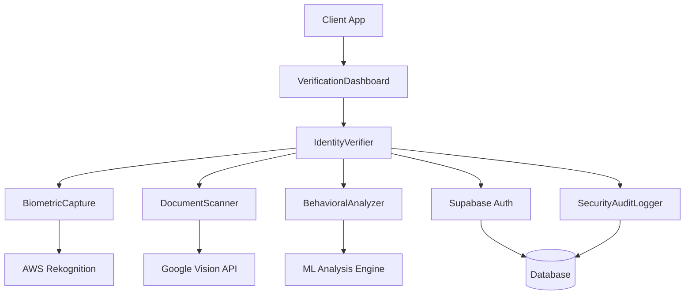

# Advanced Identity Verification Service

## Overview

The Advanced Identity Verification Service is a comprehensive, multi-layered authentication system that combines biometric authentication, behavioral analysis, and document verification to provide enterprise-grade identity verification for high-security applications.

### Key Features

- **Multi-Factor Biometric Authentication**: Facial recognition, fingerprint scanning, and voice recognition
- **Document Verification**: Real-time OCR and validation of government-issued IDs
- **Behavioral Analysis**: ML-powered pattern recognition for fraud detection
- **Real-time Processing**: WebRTC-based live capture and instant verification
- **Enterprise Security**: End-to-end encryption with AES-256 and FIPS compliance
- **Audit Trail**: Comprehensive logging and compliance reporting
- **Dashboard Interface**: Real-time monitoring and verification management

## Architecture

### System Components



### Core Components

#### BiometricCapture
Handles real-time capture and processing of biometric data including facial recognition, fingerprint scanning, and voice pattern analysis.

#### DocumentScanner
Provides OCR capabilities for government-issued documents with real-time validation against official databases.

#### BehavioralAnalyzer
Implements machine learning algorithms to analyze user behavior patterns and detect potential fraud or impersonation attempts.

#### IdentityVerifier
Central orchestration service that coordinates multi-factor verification processes and makes final authentication decisions.

#### VerificationDashboard
React-based dashboard for monitoring verification attempts, managing user profiles, and generating compliance reports.

#### SecurityAuditLogger
Comprehensive audit logging system that tracks all verification attempts and security events for compliance and forensic analysis.

## Installation

```bash
# Install dependencies
npm install

# Install additional biometric libraries
npm install @biometric/face-api @biometric/fingerprint-sdk

# Install document processing dependencies
npm install tesseract.js pdf-parse

# Install ML dependencies
npm install @tensorflow/tfjs @tensorflow/tfjs-node

# Install security dependencies
npm install crypto-js node-forge
```

### Environment Configuration

```bash
# .env
DATABASE_URL=your_supabase_database_url
SUPABASE_ANON_KEY=your_supabase_anon_key
SUPABASE_SERVICE_ROLE_KEY=your_service_role_key

# AWS Configuration
AWS_ACCESS_KEY_ID=your_aws_access_key
AWS_SECRET_ACCESS_KEY=your_aws_secret_key
AWS_REGION=us-east-1

# Google Cloud Configuration
GOOGLE_APPLICATION_CREDENTIALS=path/to/service-account.json

# Encryption Keys
BIOMETRIC_ENCRYPTION_KEY=your_256_bit_encryption_key
DOCUMENT_ENCRYPTION_KEY=your_256_bit_encryption_key

# Security Configuration
JWT_SECRET=your_jwt_secret
RATE_LIMIT_WINDOW=900000
RATE_LIMIT_MAX_REQUESTS=10

# Compliance Settings
GDPR_ENABLED=true
CCPA_ENABLED=true
DATA_RETENTION_DAYS=2555
```

## API Reference

### Authentication Endpoints

#### POST /api/identity/verify
Initiates a comprehensive identity verification process.

```typescript
interface VerificationRequest {
  userId: string;
  verificationLevel: 'basic' | 'enhanced' | 'maximum';
  methods: ('biometric' | 'document' | 'behavioral')[];
  metadata?: {
    deviceFingerprint: string;
    geolocation?: {
      latitude: number;
      longitude: number;
    };
    userAgent: string;
  };
}

interface VerificationResponse {
  verificationId: string;
  status: 'pending' | 'in_progress' | 'completed' | 'failed';
  requiredSteps: VerificationStep[];
  sessionToken: string;
  expiresAt: string;
}
```

**Example Request:**
```bash
curl -X POST /api/identity/verify \
  -H "Authorization: Bearer ${JWT_TOKEN}" \
  -H "Content-Type: application/json" \
  -d '{
    "userId": "user_123",
    "verificationLevel": "enhanced",
    "methods": ["biometric", "document", "behavioral"],
    "metadata": {
      "deviceFingerprint": "fp_abc123",
      "userAgent": "Mozilla/5.0..."
    }
  }'
```

#### POST /api/identity/biometric
Captures and processes biometric data.

```typescript
interface BiometricCaptureRequest {
  verificationId: string;
  biometricType: 'face' | 'fingerprint' | 'voice';
  data: string; // Base64 encoded biometric data
  liveness?: boolean; // Enable liveness detection
}

interface BiometricCaptureResponse {
  success: boolean;
  confidence: number;
  match: boolean;
  livenessScore?: number;
  features: {
    quality: number;
    uniqueness: number;
  };
}
```

#### POST /api/identity/document
Processes document verification.

```typescript
interface DocumentVerificationRequest {
  verificationId: string;
  documentType: 'passport' | 'drivers_license' | 'national_id';
  frontImage: string; // Base64 encoded
  backImage?: string; // Base64 encoded (if applicable)
  selfieImage: string; // For face matching
}

interface DocumentVerificationResponse {
  success: boolean;
  extractedData: {
    fullName: string;
    dateOfBirth: string;
    documentNumber: string;
    expirationDate: string;
    issueDate: string;
    nationality: string;
  };
  validation: {
    documentAuthenticity: number;
    faceMatch: number;
    dataConsistency: number;
  };
  flags: string[];
}
```

### Behavioral Analysis Endpoints

#### POST /api/identity/behavioral/start
Initiates behavioral analysis session.

```typescript
interface BehavioralAnalysisRequest {
  verificationId: string;
  analysisType: 'keystroke' | 'mouse' | 'navigation' | 'comprehensive';
  duration: number; // Analysis duration in seconds
}
```

#### POST /api/identity/behavioral/events
Submits behavioral events for analysis.

```typescript
interface BehavioralEvent {
  timestamp: number;
  type: 'keydown' | 'keyup' | 'mousemove' | 'click' | 'scroll';
  data: {
    key?: string;
    coordinates?: { x: number; y: number };
    pressure?: number;
    velocity?: number;
  };
}
```

### Administrative Endpoints

#### GET /api/identity/verifications
Retrieves verification history and statistics.

```typescript
interface VerificationQuery {
  userId?: string;
  status?: string;
  dateFrom?: string;
  dateTo?: string;
  page?: number;
  limit?: number;
}
```

#### GET /api/identity/audit
Retrieves audit logs for compliance reporting.

```typescript
interface AuditQuery {
  eventType?: string;
  userId?: string;
  dateFrom: string;
  dateTo: string;
  includePersonalData?: boolean;
}
```

## Database Schema

### verification_attempts Table

```sql
CREATE TABLE verification_attempts (
    id UUID PRIMARY KEY DEFAULT gen_random_uuid(),
    user_id UUID NOT NULL REFERENCES auth.users(id),
    verification_level TEXT NOT NULL CHECK (verification_level IN ('basic', 'enhanced', 'maximum')),
    status TEXT NOT NULL CHECK (status IN ('pending', 'in_progress', 'completed', 'failed', 'expired')),
    methods_requested TEXT[] NOT NULL,
    methods_completed TEXT[] DEFAULT '{}',
    
    -- Results
    overall_score DECIMAL(5,4),
    biometric_score DECIMAL(5,4),
    document_score DECIMAL(5,4),
    behavioral_score DECIMAL(5,4),
    
    -- Metadata
    device_fingerprint TEXT,
    ip_address INET,
    user_agent TEXT,
    geolocation JSONB,
    
    -- Timestamps
    started_at TIMESTAMP WITH TIME ZONE DEFAULT NOW(),
    completed_at TIMESTAMP WITH TIME ZONE,
    expires_at TIMESTAMP WITH TIME ZONE,
    
    -- Audit
    created_at TIMESTAMP WITH TIME ZONE DEFAULT NOW(),
    updated_at TIMESTAMP WITH TIME ZONE DEFAULT NOW()
);

-- Indexes
CREATE INDEX idx_verification_attempts_user_id ON verification_attempts(user_id);
CREATE INDEX idx_verification_attempts_status ON verification_attempts(status);
CREATE INDEX idx_verification_attempts_created_at ON verification_attempts(created_at);

-- RLS Policies
ALTER TABLE verification_attempts ENABLE ROW LEVEL SECURITY;

CREATE POLICY "Users can view own verification attempts" ON verification_attempts
    FOR SELECT USING (auth.uid() = user_id);

CREATE POLICY "Service can manage all verification attempts" ON verification_attempts
    FOR ALL USING (auth.jwt() ->> 'role' = 'service_role');
```

### biometric_profiles Table

```sql
CREATE TABLE biometric_profiles (
    id UUID PRIMARY KEY DEFAULT gen_random_uuid(),
    user_id UUID NOT NULL REFERENCES auth.users(id),
    biometric_type TEXT NOT NULL CHECK (biometric_type IN ('face', 'fingerprint', 'voice')),
    
    -- Encrypted biometric templates
    template_data TEXT NOT NULL, -- AES-256 encrypted
    template_hash TEXT NOT NULL, -- SHA-256 for quick matching
    
    -- Quality metrics
    quality_score DECIMAL(5,4),
    uniqueness_score DECIMAL(5,4),
    
    -- Metadata
    capture_method TEXT,
    device_info JSONB,
    
    -- Security
    encryption_key_id TEXT NOT NULL,
    salt TEXT NOT NULL,
    
    -- Timestamps
    enrolled_at TIMESTAMP WITH TIME ZONE DEFAULT NOW(),
    last_used_at TIMESTAMP WITH TIME ZONE,
    expires_at TIMESTAMP WITH TIME ZONE,
    
    UNIQUE(user_id, biometric_type)
);

-- Indexes
CREATE INDEX idx_biometric_profiles_user_id ON biometric_profiles(user_id);
CREATE INDEX idx_biometric_profiles_type ON biometric_profiles(biometric_type);
CREATE INDEX idx_biometric_profiles_hash ON biometric_profiles(template_hash);

-- RLS Policies
ALTER TABLE biometric_profiles ENABLE ROW LEVEL SECURITY;

CREATE POLICY "Users can view own biometric profiles" ON biometric_profiles
    FOR SELECT USING (auth.uid() = user_id);

CREATE POLICY "Service can manage biometric profiles" ON biometric_profiles
    FOR ALL USING (auth.jwt() ->> 'role' = 'service_role');
```

### document_verifications Table

```sql
CREATE TABLE document_verifications (
    id UUID PRIMARY KEY DEFAULT gen_random_uuid(),
    verification_id UUID NOT NULL REFERENCES verification_attempts(id),
    document_type TEXT NOT NULL,
    
    -- Extracted data (encrypted)
    extracted_data_encrypted TEXT NOT NULL,
    document_number_hash TEXT NOT NULL,
    
    -- Validation scores
    authenticity_score DECIMAL(5,4),
    face_match_score DECIMAL(5,4),
    data_consistency_score DECIMAL(5,4),
    
    -- Flags and warnings
    validation_flags TEXT[],
    risk_indicators JSONB,
    
    -- Image hashes (for deduplication)
    front_image_hash TEXT,
    back_image_hash TEXT,
    selfie_image_hash TEXT,
    
    -- Timestamps
    processed_at TIMESTAMP WITH TIME ZONE DEFAULT NOW(),
    
    FOREIGN KEY (verification_id) REFERENCES verification_attempts(id) ON DELETE CASCADE
);
```

### behavioral_patterns Table

```sql
CREATE TABLE behavioral_patterns (
    id UUID PRIMARY KEY DEFAULT gen_random_uuid(),
    user_id UUID NOT NULL REFERENCES auth.users(id),
    verification_id UUID REFERENCES verification_attempts(id),
    
    -- Pattern data (encrypted)
    keystroke_pattern TEXT,
    mouse_pattern TEXT,
    navigation_pattern TEXT,
    
    -- Analysis results
    pattern_confidence DECIMAL(5,4),
    anomaly_score DECIMAL(5,4),
    risk_score DECIMAL(5,4),
    
    -- Session metadata
    session_duration INTEGER,
    events_captured INTEGER,
    analysis_version TEXT,
    
    created_at TIMESTAMP WITH TIME ZONE DEFAULT NOW()
);
```

### security_audit_logs Table

```sql
CREATE TABLE security_audit_logs (
    id UUID PRIMARY KEY DEFAULT gen_random_uuid(),
    event_type TEXT NOT NULL,
    user_id UUID REFERENCES auth.users(id),
    verification_id UUID REFERENCES verification_attempts(id),
    
    -- Event details
    event_data JSONB NOT NULL,
    risk_level TEXT CHECK (risk_level IN ('low', 'medium', 'high', 'critical')),
    
    -- Context
    ip_address INET,
    user_agent TEXT,
    device_fingerprint TEXT,
    
    -- Timestamps
    occurred_at TIMESTAMP WITH TIME ZONE DEFAULT NOW(),
    
    -- Compliance
    retention_until TIMESTAMP WITH TIME ZONE
);

-- Indexes for audit queries
CREATE INDEX idx_audit_logs_event_type ON security_audit_logs(event_type);
CREATE INDEX idx_audit_logs_user_id ON security_audit_logs(user_id);
CREATE INDEX idx_audit_logs_occurred_at ON security_audit_logs(occurred_at);
CREATE INDEX idx_audit_logs_risk_level ON security_audit_logs(risk_level);
```

## Security Implementation

### Biometric Data Encryption

```typescript
// src/services/identity-verification/security/BiometricEncryption.ts
import crypto from 'crypto';
import { createCipheriv, createDecipheriv, randomBytes } from 'crypto';

export class BiometricEncryption {
  private readonly algorithm = 'aes-256-gcm';
  private readonly keyLength = 32; // 256 bits
  private readonly ivLength = 16; // 128 bits
  private readonly tagLength = 16; // 128 bits

  constructor(private masterKey: string) {}

  async encryptBiometricData(data: string, userId: string): Promise<{
    encrypted: string;
    salt: string;
    keyId: string;
  }> {
    // Generate unique salt and derivation key for user
    const salt = randomBytes(32).toString('hex');
    const derivedKey = crypto.pbkdf2Sync(this.masterKey + userId, salt, 100000, this.keyLength, 'sha512');
    
    // Generate IV
    const iv = randomBytes(this.ivLength);
    
    // Create cipher
    const cipher = createCipheriv(this.algorithm, derivedKey, iv);
    
    // Encrypt data
    let encrypted = cipher.update(data, 'utf8', 'hex');
    encrypted += cipher.final('hex');
    
    // Get authentication tag
    const tag = cipher.getAuthTag();
    
    // Combine IV, encrypted data, and tag
    const combined = Buffer.concat([iv, Buffer.from(encrypted, 'hex'), tag]);
    
    return {
      encrypted: combined.toString('base64'),
      salt,
      keyId: crypto.createHash('sha256').update(derivedKey).digest('hex').substring(0, 16)
    };
  }

  async decryptBiometricData(encryptedData: string, salt: string, userId: string): Promise<string> {
    // Derive key using same parameters
    const derivedKey = crypto.pbkdf2Sync(this.masterKey + userId, salt, 100000, this.keyLength, 'sha512');
    
    // Parse combined data
    const combined = Buffer.from(encryptedData, 'base64');
    const iv = combined.slice(0, this.ivLength);
    const encrypted = combined.slice(this.ivLength, -this.tagLength);
    const tag = combined.slice(-this.tagLength);
    
    // Create decipher
    const decipher = createDecipheriv(this.algorithm, derivedKey, iv);
    decipher.setAuthTag(tag);
    
    // Decrypt data
    let decrypted = decipher.update(encrypted, null, 'utf8');
    decrypted += decipher.final('utf8');
    
    return decrypted;
  }

  generateTemplateHash(biometricData: string): string {
    return crypto.createHash('sha256').update(biometricData).digest('hex');
  }
}
```

### Access Control and RLS

```typescript
// src/services/identity-verification/security/AccessControl.ts
import { SupabaseClient } from '@supabase/supabase-js';

export class AccessControl {
  constructor(private supabase: SupabaseClient) {}

  async validateUserAccess(userId: string, verificationId: string): Promise<boolean> {
    const { data, error } = await this.supabase
      .from('verification_attempts')
      .select('user_id')
      .eq('id', verificationId)
      .eq('user_id', userId)
      .single();

    return !error && !!data;
  }

  async checkRateLimit(userId: string, action: string): Promise<boolean> {
    const windowStart = new Date(Date.now() - 15 * 60 * 1000); // 15 minutes

    const { count, error } = await this.supabase
      .from('security_audit_logs')
      .select('*', { count: 'exact', head: true })
      .eq('user_id', userId)
      .eq('event_type', action)
      .gte('occurred_at', windowStart.toISOString());

    if (error) throw error;

    return (count || 0) < 10; // Max 10 attempts per 15 minutes
  }

  async logSecurityEvent(event: {
    eventType: string;
    userId?: string;
    verificationId?: string;
    eventData: any;
    riskLevel: 'low' | 'medium' | 'high' | 'critical';
    ipAddress?: string;
    userAgent?: string;
    deviceFingerprint?: string;
  }): Promise<void> {
    const retentionDate = new Date();
    retentionDate.setDate(retentionDate.getDate() + 2555); // 7 years retention

    await this.supabase.from('security_audit_logs').insert({
      event_type: event.eventType,
      user_id: event.userId,
      verification_id: event.verificationId,
      event_data: event.eventData,
      risk_level: event.riskLevel,
      ip_address: event.ipAddress,
      user_agent: event.userAgent,
      device_fingerprint: event.deviceFingerprint,
      retention_until: retentionDate.toISOString()
    });
  }
}
```

## Integration Examples

### React Component for Biometric Capture

```typescript
// src/services/identity-verification/components/BiometricCapture.tsx
import React, { useRef, useEffect, useState } from 'react';
import { Camera } from '@mediapipe/camera_utils';
import { FaceMesh } from '@mediapipe/face_mesh';

interface BiometricCaptureProps {
  verificationId: string;
  onCapture: (biometricData: string) => Promise<void>;
  biometricType: 'face' | 'fingerprint' | 'voice';
}

export const BiometricCapture: React.FC<BiometricCaptureProps> = ({
  verificationId,
  onCapture,
  biometricType
}) => {
  const videoRef = useRef<HTMLVideoElement>(null);
  const canvasRef = useRef<HTMLCanvasElement>(null);
  const [isCapturing, setIsCapturing] = useState(false);
  const [livenessScore, setLivenessScore] = useState(0);
  
  useEffect(() => {
    if (biometricType === 'face') {
      initializeFaceCapture();
    }
  }, [biometricType]);

  const initializeFaceCapture = async () => {
    if (!videoRef.current) return;

    // Initialize MediaPipe Face Mesh
    const faceMesh = new FaceMesh({
      locateFile: (file) => `https://cdn.jsdelivr.net/npm/@mediapipe/face_mesh/${file}`
    });

    faceMesh.setOptions({
      maxNumFaces: 1,
      refineLandmarks: true,
      minDetectionConfidence: 0.5,
      minTrackingConfidence: 0.5
    });

    faceMesh.onResults(onFaceResults);

    // Initialize camera
    const camera = new Camera(videoRef.current, {
      onFrame: async () => {
        if (videoRef.current) {
          await faceMesh.send({ image: videoRef.current });
        }
      },
      width: 640,
      height: 480
    });

    camera.start();
  };

  const onFaceResults = (results: any) => {
    if (!canvasRef.current || !videoRef.current) return;

    const canvas = canvasRef.current;
    const ctx = canvas.getContext('2d');
    if (!ctx) return;

    // Clear canvas
    ctx.clearRect(0, 0, canvas.width, canvas.height);

    // Draw video frame
    ctx.drawImage(videoRef.current, 0, 0, canvas.width, canvas.height);

    if (results.multiFaceLandmarks && results.multiFaceLandmarks.length > 0) {
      const landmarks = results.multiFaceLandmarks[0];
      
      // Calculate liveness score based on eye blinks, head movement
      const currentLiveness = calculateLivenessScore(landmarks);
      setLivenessScore(currentLiveness);

      // Draw face mesh
      drawFaceMesh(ctx, landmarks);
    }
  };

  const calculateLivenessScore = (landmarks: any[]): number => {
    // Implement liveness detection algorithm
    // This is a simplified example
    const leftEye = landmarks.slice(33, 42);
    const rightEye = landmarks.slice(362, 374);
    
    // Calculate eye aspect ratio
    const leftEAR = calculateEyeAspectRatio(leftEye);
    const rightEAR = calculateEyeAspectRatio(rightEye);
    const avgEAR = (leftEAR + rightEAR) / 2;
    
    // Simplified liveness score based on eye openness variation
    return Math.min(1, avgEAR * 10);
  };

  const calculateEyeAspectRatio = (eyeLandmarks: any[]): number => {
    // Calculate vertical distances
    const vertical1 = distance(eyeLandmarks[1], eyeLandmarks[5]);
    const vertical2 = distance(eyeLandmarks[2], eyeLandmarks[4]);
    
    // Calculate horizontal distance
    const horizontal = distance(eyeLandmarks[0], eyeLandmarks[3]);
    
    // Eye aspect ratio
    return (vertical1 + vertical2) / (2.0 * horizontal);
  };

  const distance = (point1: any, point2: any): number => {
    return Math.sqrt(Math